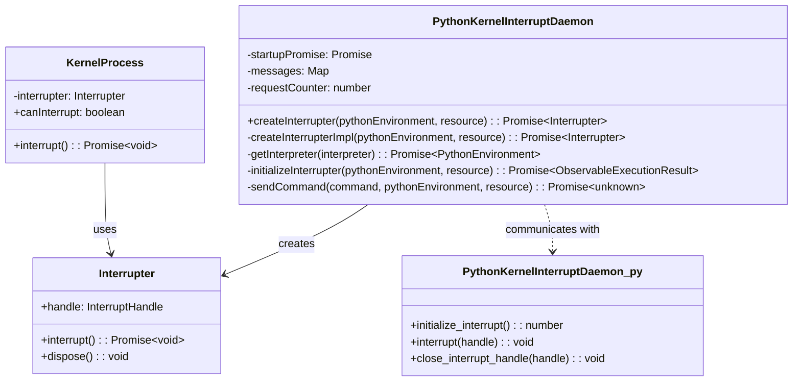
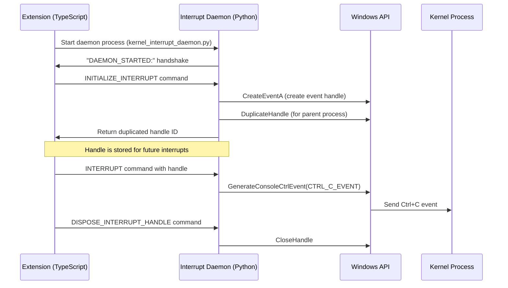
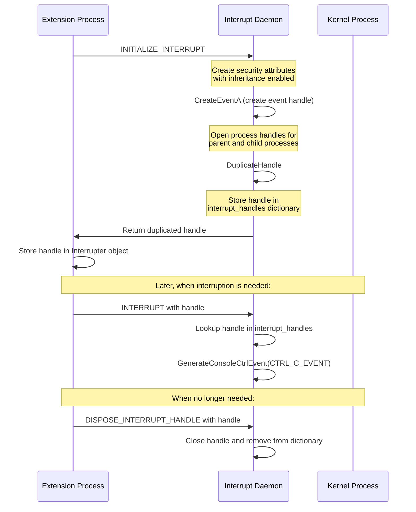

# Kernel Interruption on Windows in vscode-jupyter

This document provides an in-depth explanation of how the vscode-jupyter extension handles kernel interruption on Windows. It covers the components involved, their interactions, and the unique Windows-specific mechanism used to safely interrupt Python kernels.

## Table of Contents

1. [Overview](#overview)
2. [Core Components](#core-components)
3. [Windows Interruption Challenges](#windows-interruption-challenges)
4. [Interrupt Daemon Architecture](#interrupt-daemon-architecture)
5. [Interrupt Process Workflow](#interrupt-process-workflow)
6. [Handle Management](#handle-management)
7. [Component Interactions](#component-interactions)

## Overview

Interrupting a kernel is a critical operation that allows users to stop code execution. While UNIX-like systems can use signals (like SIGINT) to interrupt processes, Windows does not have the same signal handling mechanism. The vscode-jupyter extension implements a specialized solution for Windows using a dedicated Python daemon process and Windows-specific handle-based interruption.

## Core Components

The kernel interruption system on Windows involves several key components:



### Key Classes and Interfaces

1. **PythonKernelInterruptDaemon**: A TypeScript class that manages communication with a Python daemon process for kernel interruption.
2. **Interrupter**: An interface representing an object that can interrupt a kernel using a Windows handle.
3. **KernelProcess**: The class that manages a running kernel process and uses the interrupter to send interrupt signals.
4. **kernel_interrupt_daemon.py**: A Python script that runs as a daemon and handles the Windows-specific interruption mechanisms.

## Windows Interruption Challenges

Windows does not support the standard POSIX signals used on UNIX-like systems for process control. This creates several challenges:

1. No direct equivalent to SIGINT (Ctrl+C signal) that can be programmatically sent to processes
2. Limited cross-process signaling capabilities
3. Need for special handle-based mechanisms to communicate interruption requests

To address these challenges, the vscode-jupyter extension implements a specialized solution involving:

1. A persistent Python daemon process that manages interruption handles
2. Windows-specific API calls through ctypes
3. Event handle duplication between processes
4. Console control event generation

## Interrupt Daemon Architecture

The interrupt system is designed around a long-running Python daemon process that manages interrupt handles and communicates with the main extension process:



## Interrupt Process Workflow

The complete workflow for interrupting a kernel on Windows involves several steps:

```mermaid
flowchart TD
    A[User interrupts kernel] --> B[KernelProcess.interrupt() called]
    B --> C{canInterrupt?}
    C -->|Yes| D{Has interrupter?}
    C -->|No| E[Use message-based interruption]

    D -->|Yes| F[Call interrupter.interrupt()]
    D -->|No| G[Create new interrupter]
    G --> F

    F --> H[Send INTERRUPT command to daemon]
    H --> I[Daemon calls GenerateConsoleCtrlEvent]
    I --> J[Kernel receives Ctrl+C event]
    J --> K[Kernel execution stops]

    E --> L[Send interrupt_request message to kernel]
    L --> K
```

## Handle Management

Windows handles are key to the interruption mechanism. The system uses the following handle management workflow:



## Component Interactions

### PythonKernelInterruptDaemon

The `PythonKernelInterruptDaemon` class manages the lifecycle of the Python interrupt daemon and communication with it:

**Key Methods:**

- `createInterrupter`: Creates an Interrupter instance for a specific Python environment
- `initializeInterrupter`: Starts the Python daemon process if not already running
- `sendCommand`: Sends commands to the daemon process and waits for responses

```typescript
public async createInterrupter(pythonEnvironment: PythonEnvironment, resource: Resource): Promise<Interrupter> {
    try {
        return await this.createInterrupterImpl(pythonEnvironment, resource);
    } catch (ex) {
        logger.error(`Failed to create interrupter, trying again`, ex);
        return this.createInterrupterImpl(pythonEnvironment, resource);
    }
}
```

### Kernel Interrupt Daemon (Python)

The Python daemon script (`kernel_interrupt_daemon.py`) implements the Windows-specific interruption mechanism:

**Key Methods:**

- `initialize_interrupt`: Creates a Windows event handle that can be used for interruption
- `interrupt`: Sends a Ctrl+C event to the kernel process
- `close_interrupt_handle`: Cleans up the handle when no longer needed

```python
def initialize_interrupt(self):
    """Create an interrupt event handle.
    The parent process should call this to create the
    interrupt event that is passed to the child process. It should store
    this handle and use it with ``send_interrupt`` to interrupt the child
    process.

    Return the dupe interrupt handle for the parent process.
    """
    # Create a security attributes struct that permits inheritance of the
    # handle by new processes.
    # ...

    # Create the event in the child process
    interrupt_handle = ctypes.windll.kernel32.CreateEventA(sa_p, False, False, 0)

    # Duplicate the handle for the parent process
    # ...

    # Return the duplicated handle
```

### KernelProcess

The `KernelProcess` class uses the interrupter to send interrupt signals to the kernel:

**Key Method: `interrupt`**

```typescript
public async interrupt(): Promise<void> {
    if (!this.canInterrupt) {
        throw new Error('Cannot interrupt this kernel');
    } else if (
        this._kernelConnectionMetadata.kernelSpec.interrupt_mode !== 'message' &&
        this._process &&
        !this.interrupter
    ) {
        // We need to create an interrupter
        // ...
    } else if (
        this._kernelConnectionMetadata.kernelSpec.interrupt_mode !== 'message' &&
        this._process &&
        this.interrupter &&
        isPythonKernelConnection(this._kernelConnectionMetadata)
    ) {
        // Use the existing interrupter
        await this.interrupter.interrupt();
    } else {
        // Fall back to message-based interruption
        // ...
    }
}
```

### Command Protocol

The TypeScript and Python components communicate using a simple text-based protocol over stdin/stdout:

1. **Command Format**: `COMMAND:ID[:ARGS]`
   - Example: `INITIALIZE_INTERRUPT:5` or `INTERRUPT:6:12345`

2. **Response Format**: `RESPONSE:ID:RESULT`
   - Example: `RESPONSE:5:12345` (where 12345 is a handle ID)

3. **Command Types**:
   - `INITIALIZE_INTERRUPT`: Create a new interrupt handle
   - `INTERRUPT`: Send an interrupt signal using a handle
   - `DISPOSE_INTERRUPT_HANDLE`: Clean up a handle

This protocol allows the TypeScript code to issue commands to the Python daemon and receive responses, enabling the cross-process communication needed for Windows-specific kernel interruption.

## Technical Details of Windows Handle Creation

The Windows handle creation process involves several Windows API calls through ctypes:

1. **Create Security Attributes**: Set up a structure that allows handle inheritance
2. **Create Event Handle**: Call `CreateEventA` to create an event object
3. **Duplicate Handle**: Call `DuplicateHandle` to create a copy of the handle for the parent process
4. **Generate Control Event**: When interrupting, call `GenerateConsoleCtrlEvent(CTRL_C_EVENT, 0)` to send a Ctrl+C event

This approach allows the extension to interrupt Python kernels on Windows in a way that mimics the SIGINT behavior available on UNIX-like systems.
