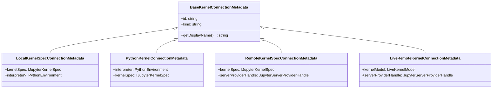
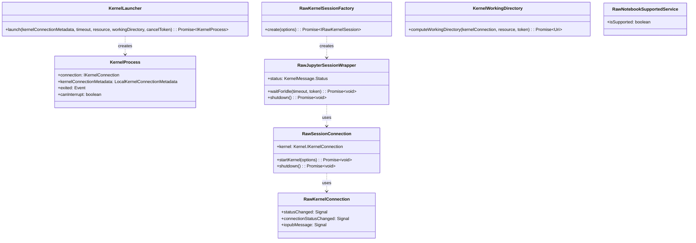
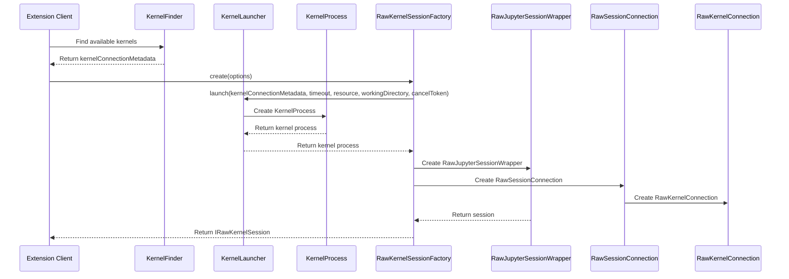
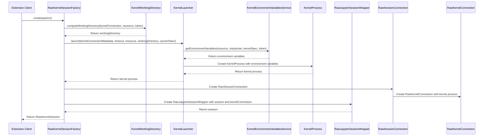
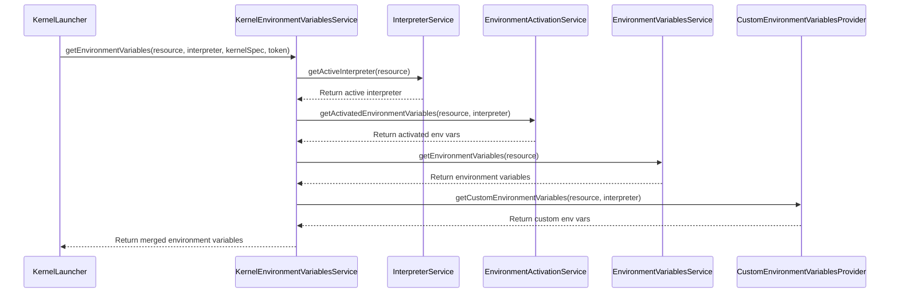
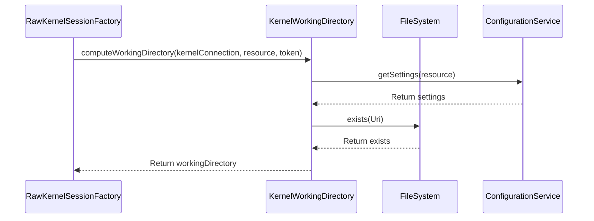

# Kernel Startup Architecture in vscode-jupyter

This document provides an in-depth explanation of the kernel startup architecture in the vscode-jupyter extension. It covers the components involved, their interactions, and the workflow for starting different types of kernels.

## Table of Contents

1. [Overview](#overview)
2. [Core Components](#core-components)
3. [Kernel Startup Workflow](#kernel-startup-workflow)
4. [Raw Kernel Startup Process](#raw-kernel-startup-process)
5. [Environment Variables Handling](#environment-variables-handling)
6. [Kernel Working Directory](#kernel-working-directory)
7. [Component Interactions](#component-interactions)

## Overview

The vscode-jupyter extension supports various types of kernel connections:

- **Local Python Kernels**: Launched using Python interpreters on the local machine
- **Local Kernel Specs**: Launched using kernel specifications on the local machine
- **Remote Kernel Specs**: Launched using kernel specifications on remote Jupyter servers
- **Live Remote Kernels**: Connecting to already running kernels on remote Jupyter servers

The kernel startup process varies depending on the type of kernel being launched. This document focuses primarily on the startup process for local kernels (Python interpreters and local kernel specs).

## Core Components

The following core components are involved in the kernel startup process:

### Kernel Connection Metadata Classes

These classes encapsulate the information needed to connect to different types of kernels:



### Key Services and Interfaces

The kernel startup process involves several key services and interfaces:

```mermaid
classDiagram
    class IKernelLauncher {
        +launch(kernelConnectionMetadata, timeout, resource, workingDirectory, cancelToken): Promise~IKernelProcess~
    }

    class IRawKernelSessionFactory {
        +create(options: LocaLKernelSessionCreationOptions): Promise~IRawKernelSession~
    }

    class IKernelProcess {
        +connection: IKernelConnection
        +kernelConnectionMetadata: LocalKernelConnectionMetadata
        +exited: Event
        +canInterrupt: boolean
    }

    class IRawKernelSession {
        +status: KernelMessage.Status
        +waitForIdle(timeout, token): Promise~void~
        +shutdown(): Promise~void~
    }

    class KernelEnvironmentVariablesService {
        +getEnvironmentVariables(resource, interpreter, kernelSpec, token): Promise~EnvironmentVariables~
    }

    class IKernelWorkingDirectory {
        +computeWorkingDirectory(kernelConnection, resource, token): Promise~Uri~
    }

    class IRawNotebookSupportedService {
        +isSupported: boolean
    }

    IKernelLauncher --> IKernelProcess: creates
    IRawKernelSessionFactory --> IRawKernelSession: creates
```



### Implementation Classes



## Kernel Startup Workflow

The kernel startup process involves several steps and multiple components. The high-level workflow is as follows:



## Raw Kernel Startup Process

The raw kernel startup process is more detailed and involves several components:



## Environment Variables Handling

The `KernelEnvironmentVariablesService` is responsible for gathering and preparing the environment variables needed for the kernel process:



## Kernel Working Directory

The `KernelWorkingDirectory` service computes the appropriate working directory for the kernel:



## Component Interactions

### KernelLauncher

The `KernelLauncher` is responsible for launching a kernel process. It performs the following steps:

1. Resolve the environment variables for the kernel using `KernelEnvironmentVariablesService`
2. Generate a connection file for the kernel with unique ports
3. Launch the kernel process using the appropriate command line arguments
4. Return an `IKernelProcess` instance

**Key Method: `launch`**

```typescript
public async launch(
    kernelConnectionMetadata: LocalKernelSpecConnectionMetadata | PythonKernelConnectionMetadata,
    timeout: number,
    resource: Resource,
    workingDirectory: string,
    cancelToken: CancellationToken
): Promise<IKernelProcess>
```

### KernelProcess

The `KernelProcess` class represents a running kernel process. It manages:

1. The kernel process lifecycle
2. Connection information
3. Monitoring the process status and output
4. Handling process termination

**Key Properties and Events:**

- `connection`: The connection information (ports, etc.) for the kernel
- `exited`: Event triggered when the process exits
- `canInterrupt`: Whether the kernel can be interrupted

### RawKernelSessionFactory

The `RawKernelSessionFactory` creates an `IRawKernelSession` that can be used to communicate with a kernel. It:

1. Computes the working directory for the kernel
2. Launches the kernel process
3. Creates a session wrapper

**Key Method: `create`**

```typescript
public async create(options: LocaLKernelSessionCreationOptions): Promise<IRawKernelSession>
```

### RawJupyterSessionWrapper

The `RawJupyterSessionWrapper` wraps a `RawSessionConnection` and provides the `IRawKernelSession` interface. It handles:

1. Session status management
2. Kernel message routing
3. Shutdown and restart operations

**Key Methods:**

- `waitForIdle`: Waits for the kernel to be in an idle state
- `shutdown`: Shuts down the kernel

### RawSessionConnection

The `RawSessionConnection` implements the JupyterLab `ISessionConnection` interface for a raw kernel. It:

1. Manages the kernel connection
2. Handles session events
3. Provides a standard interface for kernel operations

**Key Methods:**

- `startKernel`: Starts the kernel
- `shutdown`: Shuts down the kernel

### RawKernelConnection

The `RawKernelConnection` implements the JupyterLab `IKernelConnection` interface for a raw kernel. It:

1. Manages the ZMQ sockets
2. Handles kernel messages
3. Maintains kernel status

**Key Events:**

- `statusChanged`: Triggered when the kernel status changes
- `iopubMessage`: Triggered when a message is received on the iopub channel
- `connectionStatusChanged`: Triggered when the connection status changes

### KernelEnvironmentVariablesService

The `KernelEnvironmentVariablesService` resolves the environment variables for a kernel. It:

1. Gets environment variables from the interpreter
2. Gets activated environment variables
3. Gets custom environment variables
4. Merges all sources

**Key Method: `getEnvironmentVariables`**

```typescript
public async getEnvironmentVariables(
    resource: Resource,
    interpreter: PythonEnvironment | undefined,
    kernelSpec: IJupyterKernelSpec,
    token?: CancellationToken
): Promise<EnvironmentVariables>
```

### KernelWorkingDirectory

The `KernelWorkingDirectory` computes the working directory for a kernel. It:

1. Checks the notebook file root setting
2. Falls back to the resource directory
3. Validates the directory exists

**Key Method: `computeWorkingDirectory`**

```typescript
async computeWorkingDirectory(
    kernelConnection: KernelConnectionMetadata,
    resource: Resource,
    token: CancellationToken
): Promise<Uri>
```

This architecture enables the vscode-jupyter extension to support various kernel types and provide a consistent interface for interacting with them, while handling the complexities of kernel launching, environment setup, and process management.
