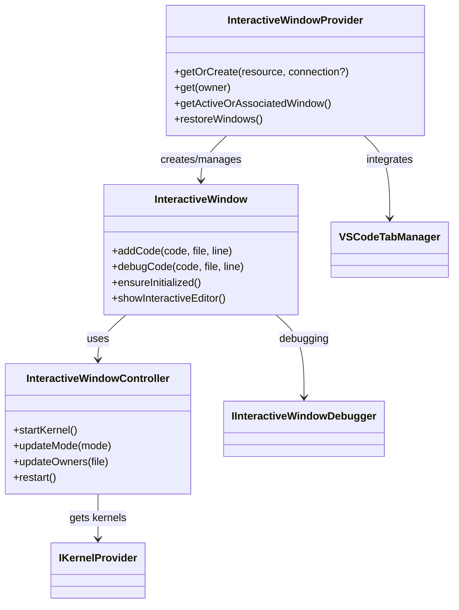
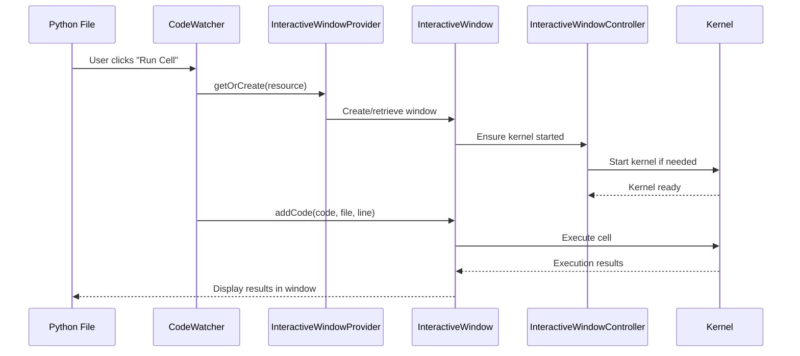
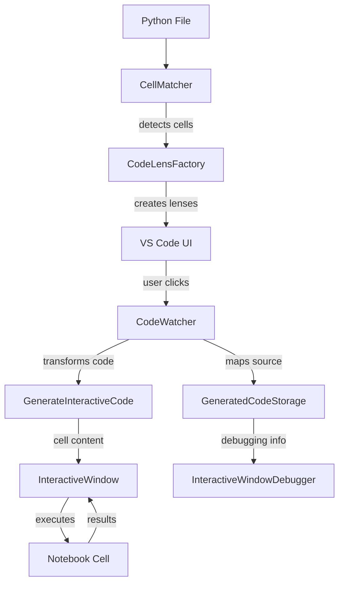
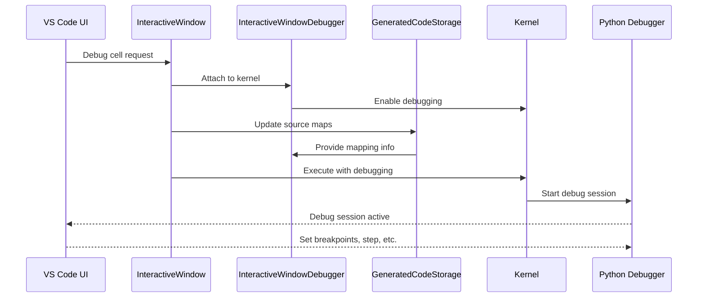

# Interactive Window System Architecture

The `src/interactive-window` directory contains the core components responsible for providing a REPL-like experience that bridges traditional Python files with notebook-style execution. This system enables users to execute code cells marked with `#%%` directly from Python files in a notebook-like interface.

## Project Structure and Organization

The Interactive Window system follows a modular architecture with clear separation between editor integration, window management, and debugging:

```
src/interactive-window/
├── types.ts                           # Core interfaces and types
├── interactiveWindow.ts               # Main window implementation
├── interactiveWindowProvider.ts       # Window factory and registry
├── interactiveWindowController.ts     # Kernel and lifecycle management
├── serviceRegistry.{node,web}.ts      # Dependency injection registration
├── editor-integration/               # Python file integration
│   ├── codeLensFactory.ts            # "Run Cell" code lenses
│   ├── codeWatcher.ts                # File monitoring and execution
│   ├── cellMatcher.ts                # Cell boundary detection
│   └── generatedCodeStorage*.ts      # Source mapping for debugging
├── debugger/                         # Debugging capabilities
│   ├── interactiveWindowDebugger.ts  # Main debugger integration
│   ├── debuggingManager.ts           # Session management
│   └── helper.ts                     # Debug utilities
└── commands/                         # User commands and API
    ├── commandRegistry.ts            # Command registration
    └── export.ts                     # Export functionality
```

## Core Components

### 1. Window Management System

**Interactive Window Provider** (`interactiveWindowProvider.ts`):

-   Central factory for creating and managing Interactive Window instances
-   Handles window-to-file associations and workspace persistence
-   Manages window lifecycle (creation, restoration, disposal)
-   Tracks active windows and ownership relationships

**Interactive Window** (`interactiveWindow.ts`):

-   Core ViewModel representing a single Interactive Window instance
-   Manages notebook document integration and cell execution
-   Provides debugging capabilities and kernel lifecycle management
-   Handles code transformation from Python files to notebook cells

**Interactive Window Controller** (`interactiveWindowController.ts`):

-   Manages kernel selection, startup, and lifecycle for Interactive Windows
-   Handles system info cell management and kernel restart logic
-   Tracks owner file associations for kernel context



### 2. Editor Integration System (`editor-integration/`)

**Code Watcher** (`codeWatcher.ts`):

-   Monitors Python files for code cells marked with `#%%`
-   Provides execution capabilities for individual cells or entire files
-   Handles various execution modes (run cell, run all, debug, etc.)
-   Manages cell navigation and manipulation

**Code Lens Factory** (`codeLensFactory.ts`):

-   Creates "Run Cell" and "Debug Cell" code lenses for Python files
-   Detects cell boundaries and provides performance monitoring
-   Handles cell range caching for large files
-   Integrates with VS Code's code lens API

**Cell Matcher** (`cellMatcher.ts`):

-   Parses Python files to identify code cell boundaries
-   Extracts cell ranges and metadata from cell markers
-   Handles different cell marker formats (`#%%`, `# %%`, etc.)
-   Provides cell navigation utilities

**Generated Code Storage** (`generatedCodeStorage*.ts`):

-   Manages mapping between source Python files and generated notebook cells
-   Tracks code generation for debugging support
-   Maintains source maps for breakpoint handling
-   Provides storage for generated code metadata

### 3. Debugging System (`debugger/`)

**Interactive Window Debugger** (`interactiveWindowDebugger.node.ts`):

-   Provides debugging capabilities for Interactive Window code execution
-   Attaches to kernels for debugging and manages source maps
-   Handles debugger protocol communication with Python debugger (debugpy)
-   Enables/disables tracing for step debugging

**Debugging Manager** (`debuggingManager.ts`):

-   Manages debugging sessions for Interactive Windows using Jupyter protocol
-   Creates debug adapter descriptors and manages session lifecycle
-   Handles cell-level debugging and mode detection
-   Provides debugging mode detection and session management

## Key Workflows

### Interactive Window Creation and Execution



### Code Cell Detection and Execution



### Debugging Workflow



## Component Interactions

### Window Lifecycle Management

**Creation Flow**:

1. User triggers code execution from Python file
2. `InteractiveWindowProvider.getOrCreate()` resolves window instance
3. If new window needed, creates `InteractiveWindow` with `InteractiveWindowController`
4. Controller selects and starts appropriate kernel
5. VS Code opens notebook editor tab for Interactive Window
6. Window ready for code execution

**Execution Flow**:

1. `CodeWatcher` detects cell execution request from code lens or command
2. Retrieves or creates Interactive Window via provider
3. Code processed by `generateInteractiveCode()` helper
4. Notebook cell created with transformed code
5. Kernel executes cell and returns results
6. `GeneratedCodeStorage` tracks source-to-cell mapping for debugging
7. Results displayed in Interactive Window

**Debugging Flow**:

1. User requests debugging via "Debug Cell" command
2. `InteractiveWindowDebugger` attaches to kernel
3. Source maps updated via `GeneratedCodeStorage`
4. Code executed with debugging enabled
5. Full debugging experience with breakpoints and stepping

## Platform Differences

### Desktop Environment (Node.js)

-   **Full debugging support**: Complete `InteractiveWindowDebugger` implementation
-   **Direct kernel management**: Local kernel process spawning and management
-   **File system integration**: Complete file watching and source mapping
-   **ZeroMQ communication**: Native kernel communication protocols

### Web Environment

-   **Limited debugging**: Jupyter protocol debugging only
-   **Remote kernels**: HTTP/WebSocket connections to remote servers
-   **Browser APIs**: Limited file system access through VS Code APIs
-   **Simplified integration**: Reduced editor integration features

## Key Features and Capabilities

### Code Cell Execution

-   **Cell markers**: Support for `#%%`, `# %%`, and similar markers
-   **Execution modes**: Run cell, run all cells, run from cursor, run to cursor
-   **Cell navigation**: Previous/next cell commands
-   **Interactive plotting**: Matplotlib and other visualization integration

### Editor Integration

-   **Code lenses**: "Run Cell" and "Debug Cell" buttons in Python files
-   **Command palette**: Rich set of commands for Interactive Window operations
-   **File watching**: Automatic updates when Python files change
-   **Performance optimization**: Cell range caching and incremental updates

### Debugging Support

-   **Breakpoints**: Full breakpoint support in source Python files
-   **Step debugging**: Step into, over, out functionality
-   **Variable inspection**: Access to kernel variables and data viewer
-   **Source mapping**: Accurate mapping between source and executed code

### Cross-Platform Compatibility

-   **Desktop VS Code**: Full feature set with local kernels
-   **VS Code for Web**: Remote kernel support with graceful degradation
-   **GitHub Codespaces**: Cloud-based development with remote kernels

## Error Handling and Recovery

### Kernel Management

-   **Automatic restart**: Detection and recovery from kernel failures
-   **Error display**: System info cells show kernel status and errors
-   **Graceful degradation**: Fallback when kernels unavailable
-   **User notifications**: Clear error messages for critical failures

### File System Issues

-   **Save fallbacks**: Alternative handling when file saves fail
-   **Source mapping**: Robust handling when files unavailable
-   **Path resolution**: Cross-platform path handling

### Performance Optimization

### Code Lens Management

-   **Cell range caching**: Improves performance for large Python files
-   **Incremental updates**: Only update changed regions
-   **Performance monitoring**: Telemetry for code lens generation times
-   **Lazy evaluation**: Defer expensive operations until needed

### Memory Management

-   **Weak references**: Prevent memory leaks with kernel configurations
-   **Event cleanup**: Proper disposal of event listeners
-   **Resource pooling**: Efficient reuse of expensive objects
-   **Storage cleanup**: Regular cleanup of generated code storage

## Development Guidelines

When working with Interactive Window code:

### Adding New Features

1. Consider platform differences (Node.js vs Web environments)
2. Implement proper error handling and user feedback
3. Use dependency injection for testability
4. Add comprehensive unit and integration tests
5. Update source mapping for debugging features

### Modifying Execution Logic

1. Maintain backward compatibility with existing workflows
2. Update related tests and source mapping
3. Consider performance impact on large Python files
4. Review cross-platform implications
5. Test with various kernel types and configurations

### Editor Integration Changes

1. Test code lens generation performance
2. Verify cell detection with various marker formats
3. Ensure proper cleanup of event listeners
4. Test file watching and change detection
5. Validate source mapping accuracy

### Testing Considerations

-   **Unit tests**: Individual component testing with mocks
-   **Integration tests**: End-to-end workflow testing with real kernels
-   **Performance tests**: Code lens generation and large file handling
-   **Cross-platform tests**: Verify compatibility across environments

### Common Patterns

-   **Event-driven updates**: Use EventEmitter for state changes
-   **Promise monitoring**: Track async operations for proper cleanup
-   **Weak references**: Avoid memory leaks with document references
-   **Cancellation support**: Respect CancellationToken in async operations
-   **Source mapping**: Maintain accurate debugging information

This architecture provides a robust foundation for Interactive Window functionality that bridges Python file editing with notebook-style execution while maintaining excellent debugging support and cross-platform compatibility.
