# IPyWidgets System Architecture

The IPyWidgets system in the Jupyter extension enables interactive widget functionality in VS Code notebooks. It provides a comprehensive infrastructure for loading, rendering, and managing interactive widgets that normally require a live Jupyter environment. This system bridges the gap between the extension's TypeScript environment and the browser-based widget rendering system.

## Project Structure and Organization

The IPyWidgets system is organized across multiple layers with clear separation of concerns:

```
src/
├── notebooks/controllers/ipywidgets/           # Extension-side IPyWidgets coordination
│   ├── message/                               # Message handling and coordination
│   │   ├── commonMessageCoordinator.ts        # Main message coordinator
│   │   ├── ipyWidgetMessageDispatcher.ts     # Kernel message dispatcher
│   │   └── ipyWidgetMessageDispatcherFactory.ts # Factory for dispatchers
│   ├── scriptSourceProvider/                  # Widget script source management
│   │   ├── baseIPyWidgetScriptManager.ts      # Base script manager
│   │   ├── cdnWidgetScriptSourceProvider.ts   # CDN script provider
│   │   ├── localWidgetScriptSourceProvider.node.ts # Local script provider
│   │   ├── remoteWidgetScriptSourceProvider.ts # Remote script provider
│   │   ├── ipyWidgetScriptSource.ts           # Script source coordinator
│   │   └── scriptSourceProviderFactory.{node,web}.ts # Platform-specific factories
│   ├── rendererVersionChecker.ts              # Widget version compatibility
│   ├── serviceRegistry.{node,web}.ts          # DI registration
│   └── types.ts                               # Core interfaces
├── webviews/extension-side/ipywidgets/        # Extension-webview communication
│   └── rendererComms.ts                       # Renderer communication bridge
├── webviews/webview-side/ipywidgets/          # Browser-side widget rendering
│   ├── kernel/                                # Proxy kernel implementation
│   │   ├── index.ts                           # Main kernel entry point
│   │   ├── manager.ts                         # Widget manager
│   │   ├── scriptManager.ts                   # Script loading manager
│   │   └── types.ts                           # Kernel-side types
│   └── renderer/                              # Widget rendering components
└── notebooks/controllers/notebookIPyWidgetCoordinator.ts # Top-level coordinator
```

## Major Components

### 1. NotebookIPyWidgetCoordinator (`notebookIPyWidgetCoordinator.ts`)

**Purpose**: Main entry point and orchestrator for IPyWidgets functionality at the notebook level.

**Key Responsibilities**:

-   Manages lifecycle of IPyWidgets per notebook document
-   Coordinates communication between VS Code UI and webview renderers
-   Handles controller selection and webview attachment
-   Creates and manages `CommonMessageCoordinator` instances per notebook

**Key Methods**:

-   `activate()`: Initializes event listeners for notebook lifecycle
-   `onDidSelectController()`: Handles kernel controller changes
-   `initializeNotebookCommunication()`: Sets up webview communication

### 2. CommonMessageCoordinator (`message/commonMessageCoordinator.ts`)

**Purpose**: Central message hub for IPyWidgets communication within a notebook.

**Key Responsibilities**:

-   Manages message flow between extension and webview
-   Handles IPyWidgets version determination and script loading
-   Coordinates between message dispatcher and script source provider
-   Manages widget load success/failure telemetry

**Key Methods**:

-   `attach()`: Attaches to a webview communication channel
-   `onMessage()`: Processes incoming messages from webview
-   `initialize()`: Sets up message dispatcher and script source provider

### 3. IPyWidgetMessageDispatcher (`message/ipyWidgetMessageDispatcher.ts`)

**Purpose**: Handles kernel message communication for IPyWidgets.

**Key Responsibilities**:

-   Proxies kernel messages between extension and webview
-   Manages comm target registration for widget communication
-   Handles message hooks for widget output processing
-   Synchronizes kernel state with webview widget manager

**Key Methods**:

-   `receiveMessage()`: Processes messages from webview
-   `sendRawPayloadToKernelSocket()`: Sends messages to kernel
-   `registerCommTarget()`: Registers communication targets
-   `onKernelSocketMessage()`: Handles incoming kernel messages

**Integration with `@jupyterlab/services`**:

-   Uses `@jupyterlab/services` for kernel message serialization/deserialization
-   Leverages `KernelMessage` interfaces for type safety
-   Utilizes `Kernel.IKernelConnection` for comm target management
-   Handles `IIOPubMessage` and `IDisplayDataMsg` types

### 4. Script Source Management (`scriptSourceProvider/`)

**Purpose**: Manages loading and serving of widget JavaScript files.

**Key Components**:

#### IPyWidgetScriptSource (`ipyWidgetScriptSource.ts`)

-   Coordinates script source requests from webview
-   Manages communication with script source providers
-   Handles widget script caching and serving

#### Script Source Providers

-   **CDNWidgetScriptSourceProvider**: Serves scripts from CDN sources
-   **LocalWidgetScriptSourceProvider**: Serves scripts from local Python environment
-   **RemoteWidgetScriptSourceProvider**: Serves scripts from remote Jupyter servers

#### IPyWidgetScriptManager (Platform-specific)

-   **LocalIPyWidgetScriptManager**: Manages local nbextensions directory
-   **RemoteIPyWidgetScriptManager**: Manages remote widget scripts
-   **BaseIPyWidgetScriptManager**: Common functionality across platforms

### 5. Webview-Side Widget System (`webviews/webview-side/ipywidgets/`)

**Purpose**: Browser-side widget rendering and management.

**Key Components**:

#### Kernel Proxy (`kernel/index.ts`)

-   Creates a proxy kernel connection in the webview
-   Manages widget lifecycle and rendering
-   Handles message passing between extension and widget manager

#### Widget Manager (`kernel/manager.ts`)

-   Integrates with JupyterLab widget manager
-   Manages widget model state and synchronization
-   Handles widget rendering and disposal

#### Script Manager (`kernel/scriptManager.ts`)

-   Dynamically loads widget JavaScript modules
-   Manages script dependencies and loading order
-   Handles script loading failures and retries

### 6. Renderer Communication (`webviews/extension-side/ipywidgets/rendererComms.ts`)

**Purpose**: Bridges communication between notebook renderers and extension.

**Key Responsibilities**:

-   Tracks widget model IDs in notebook outputs
-   Handles renderer-specific widget queries
-   Manages widget state and version information
-   Coordinates with IPyWidgetMessageDispatcher for display messages

### 7. IPyWidgets Standalone Package (`@vscode/jupyter-ipywidgets8`)

**Purpose**: Standalone package providing IPyWidgets 8.x implementation for webview consumption.

**Location**: Separate repository - `vscode-jupyter-ipywidgets`

**Key Features**:

-   Self-contained IPyWidgets 8.x implementation
-   JupyterLab compatibility layer
-   Dynamic module loading via RequireJS
-   Version-specific widget support
-   CSS and font bundling

**Package Structure**:

```
src/
├── index.ts                # Entry point with load/unload functions
├── manager.ts              # JupyterLab-compatible WidgetManager
├── documentContext.ts      # Mock document context
├── sessionConnection.ts    # Session wrapper
├── widgetLoader.ts         # RequireJS utilities
└── signal.ts              # Lumino signal re-export
```

**Critical Classes**:

-   **`WidgetManager`**: Extends `@jupyter-widgets/jupyterlab-manager`

    -   Implements dynamic widget class loading
    -   Handles script loading with fallbacks
    -   Provides error/success callbacks
    -   Registers mime renderers for nested outputs

-   **`DocumentContext`**: Mock implementation of JupyterLab's document context

    -   Implements `ISessionContext` and `DocumentRegistry.IContext`
    -   Bridges VS Code kernel with JupyterLab widget system
    -   Provides minimal required functionality

-   **`SessionConnection`**: Wrapper around kernel connection
    -   Implements `ISessionConnection` interface
    -   Delegates to underlying kernel connection
    -   Provides session-like API for compatibility

**Dynamic Loading Pattern**:

```typescript
// Global exposure for extension consumption
(window as any).vscIPyWidgets8 = {
    load, // Loads IPyWidgets 8.x scripts and CSS
    unload // Cleans up and unloads modules
};

// RequireJS module registration
define('@jupyter-widgets/controls', () => widgets);
define('@jupyter-widgets/base', () => base);
define('@jupyter-widgets/output', () => outputWidgets);
```

**Integration Points**:

-   Consumed by main extension via webpack bundle
-   Loaded conditionally based on detected IPyWidgets version
-   Provides `WidgetManager` class for webview-side widget rendering

## IPyWidgets Protocol and Communication Patterns

### 1. Widget Protocol Fundamentals

Refer to [Low Level Widget Tutorial](https://ipywidgets.readthedocs.io/en/7.x/examples/Widget%20Low%20Level.html) for a detailed overview of the IPyWidgets protocol.

#### Comm System Overview

IPyWidgets uses the Jupyter Comm system for kernel-frontend communication:

**Core Characteristics**:

-   **Symmetric**: Both kernel and frontend can initiate communication
-   **Asynchronous**: Fire-and-forget messaging with no guaranteed delivery
-   **GUID-based**: Each comm has unique identifier for message routing
-   **Target-based**: Comms registered with specific target names

**Message Types**:

-   `comm_open`: Establish new communication channel
-   `comm_msg`: Send data over established channel
-   `comm_close`: Close communication channel

#### State Synchronization Model

Widget state synchronization follows a distributed model:

**Key Principles**:

-   No single source of truth - both kernel and frontend maintain state
-   Automatic bidirectional propagation for traits marked `sync=True`
-   Conflict resolution via "last write wins" semantics
-   Custom serialization support for complex data types

### 2. Message Flow Patterns

#### Widget Creation and Display

Standard IPyWidgets creation follows this pattern:

```python
# Kernel side
from ipywidgets import IntSlider
widget = IntSlider(value=50)  # 1. Create widget instance
display(widget)               # 2. Display in cell output
```

**Corresponding Message Flow**:

```
1. Widget constructor → comm_open with target 'jupyter.widget'
2. display() call → display_data message with widget repr
3. Initial state sync → comm_msg with current trait values
4. Frontend receives messages → creates WidgetModel + WidgetView
```

#### Bidirectional State Updates

State changes propagate automatically in both directions:

**User Interaction Flow**:

```
1. User moves slider in frontend
2. JavaScript updates WidgetModel
3. Model change triggers comm_msg to kernel
4. Kernel updates widget.value
5. Any dependent calculations execute
```

**Programmatic Update Flow**:

```python
# Kernel side
widget.value = 75  # Triggers trait change notification
```

```
1. Trait change detected in kernel
2. comm_msg sent with state diff
3. Frontend WidgetModel updated
4. View re-renders with new value
```

### 3. Custom Serialization Protocol

#### Widget Reference Serialization

Widgets containing other widgets use special serialization:

**Python Side**:

```python
class Container(DOMWidget):
    children = Tuple().tag(sync=True, **widget_serialization)

# Results in comm messages like:
# {"children": ["IPY_MODEL_abc123", "IPY_MODEL_def456"]}
```

**JavaScript Side**:

```javascript
static serializers = {
    children: {
        deserialize: function(value) {
            // Resolve widget IDs to actual model instances
            return value.map(id => this.widget_manager.get_model(id));
        }
    }
}
```

#### Binary Data Handling

Large binary data (images, arrays) requires special handling:

**Buffer Protocol**:

```python
import numpy as np
from ipywidgets import Image

# Large arrays sent as buffers, not JSON
image_data = np.random.randint(0, 255, (100, 100, 3), dtype=np.uint8)
widget = Image(value=image_data.tobytes(), format='png')
```

### 4. VS Code Specific Adaptations

#### Webview Communication Bridge

VS Code's webview isolation requires message bridging:

**Extension Side**:

```typescript
// Forward kernel comms to webview
kernel.addCommTarget('jupyter.widget', (comm, msg) => {
    webview.postMessage({
        type: 'comm_open',
        comm_id: comm.id,
        target: comm.target_name,
        data: msg.content.data
    });
});
```

**Webview Side**:

```typescript
// Recreate comms in proxy kernel
onDidReceiveMessage((message) => {
    if (message.type === 'comm_open') {
        const comm = this.proxyKernel.createComm(message.target, message.data);
        comm.comm_id = message.comm_id;
    }
});
```

#### Execution Context Preservation

Widget display must be associated with correct notebook cells:

**Context Tracking**:

```typescript
// Mirror execute requests to maintain execution context
mirrorExecuteRequest(msg: IExecuteRequestMsg) {
    this.webview.postMessage({
        type: 'mirror_execute',
        msg: msg,
        parent_id: msg.header.msg_id
    });
}

// Associate display with originating cell
onDisplayData(msg: IDisplayDataMsg) {
    const parentId = msg.parent_header.msg_id;
    const cell = this.findCellByExecutionId(parentId);
    this.renderWidget(msg.content.data, cell);
}
```

### 5. Error Handling and Recovery

#### Widget Loading Failures

Handle missing or incompatible widget modules:

**Fallback Hierarchy**:

1. Try local nbextensions directory
2. Query remote Jupyter server
3. Fallback to CDN sources
4. Display error placeholder if all fail

## Kernel Hook System Deep Dive

### Hook Architecture

The IPyWidgets system relies on a sophisticated kernel hook system that intercepts WebSocket messages between the extension and Jupyter kernels. This enables transparent message forwarding to the webview without disrupting normal kernel operations.

#### KernelSocketWrapper Mixin Pattern

**File**: `src/kernels/common/kernelSocketWrapper.ts`

**Implementation**: Uses TypeScript mixin pattern to add hook capabilities to any WebSocket-like class:

```typescript
export function KernelSocketWrapper<T extends ClassType<IWebSocketLike>>(SuperClass: T) {
    return class BaseKernelSocket extends SuperClass implements IKernelSocket {
        private receiveHooks: ((data: WebSocketData) => Promise<void>)[];
        private sendHooks: ((data: any, cb?: (err?: Error) => void) => Promise<void>)[];
        private msgChain: Promise<any>;
        private sendChain: Promise<any>;

        // Override send to inject sendHooks
        public override send(data: any, a2: any): void {
            this.sendChain = this.sendChain
                .then(() => Promise.all(this.sendHooks.map((s) => s(data, a2))))
                .then(() => super.send(data, a2));
        }

        // Override emit to inject receiveHooks
        protected handleEvent(superHandler, event, ...args): boolean {
            if (event === 'message' && this.receiveHooks.length) {
                this.msgChain = this.msgChain
                    .then(() => Promise.all(this.receiveHooks.map((p) => p(args[0]))))
                    .then(() => superHandler(event, ...args))
                    .catch((e) => logger.error(`Exception while handling messages: ${e}`));
                return true;
            }
            return superHandler(event, ...args);
        }
    };
}
```

#### Message Hook Registration Process

1. **Socket Creation**: Each kernel connection creates a WebSocket with hook capabilities
2. **Hook Registration**: IPyWidgetMessageDispatcher registers receive/send hooks
3. **Message Interception**: All messages pass through hooks before normal processing
4. **Filtering**: Hooks filter and forward relevant widget messages to webview
5. **Cleanup**: Hooks properly removed on kernel disposal/restart

#### Critical Synchronization Points

##### Execute Request Mirroring

**Problem**: Extension (real kernel) and webview (fake kernel) must maintain identical kernel future state.
**Solution**: Mirror execute_request messages to webview before sending to the real kernel

```typescript
private async mirrorSend(protocol: string | undefined, data: any): Promise<void> {
    if (typeof data === 'string' && data.includes('execute_request')) {
        const msg = JSON.parse(data) as KernelMessage.IExecuteRequestMsg;
        if (msg.channel === 'shell' && msg.header.msg_type === 'execute_request') {
            if (!shouldMessageBeMirroredWithRenderer(msg)) {
                return; // Skip internal extension messages
            }
            const promise = this.mirrorExecuteRequest(msg);
            if (this.isUsingIPyWidgets) {
                await promise; // Synchronize only if widgets are active
            }
        }
    }
}
```

##### Output Widget Hook Management

**Problem**: Output widgets can register/remove hooks during state changes causing race conditions
**Solution**: Block message processing until webview confirms state change completion

```typescript
private messageNeedsFullHandle(message: any) {
    return (
        message.channel === 'iopub' &&
        message.header?.msg_type === 'comm_msg' &&
        message.content?.data?.method === 'update' &&
        this.outputWidgetIds.has(message.content?.comm_id)
    );
}

// In onKernelSocketMessage:
if (this.messageNeedsFullHandle(message)) {
    this.fullHandleMessage = { id: message.header.msg_id, promise: createDeferred<void>() };
    await promise.promise; // Wait for message acknowledgment
    await this.fullHandleMessage.promise.promise; // Wait for full handling
    this.fullHandleMessage = undefined;
}
```

#### Message Filtering Strategy

**Widget Detection**: Messages are filtered based on content analysis:

```typescript
const mustDeserialize =
    typeof data !== 'string' ||
    data.includes(WIDGET_MIMETYPE) ||
    data.includes(Identifiers.DefaultCommTarget) ||
    data.includes('comm_open') ||
    data.includes('comm_close') ||
    data.includes('comm_msg');
```

**Performance Optimization**: Only deserialize messages that potentially contain widget data to minimize processing overhead.

#### Error Recovery Mechanisms

##### Kernel Restart Handling

```typescript
private async handleKernelRestarts() {
    // Clear all pending state
    this.waitingMessageIds.forEach((d) => d.resultPromise.resolve());
    this.waitingMessageIds.clear();
    this.messageHookRequests.forEach((m) => m.resolve(false));
    this.messageHookRequests.clear();
    this.messageHooks.clear();

    // Re-register comm targets
    Array.from(this.commTargetsRegistered.keys()).forEach((targetName) => {
        this.commTargetsRegistered.delete(targetName);
        this.pendingTargetNames.add(targetName);
    });

    // Re-establish hooks
    this.subscribeToKernelSocket(this.kernel);
    this.registerCommTargets(this.kernel);
}
```

##### Hook Cleanup on Socket Changes

```typescript
private subscribeToKernelSocketImpl(kernel: IKernel, oldKernelId?: string) {
    // Remove old handlers
    const oldSocket = oldKernelId ? KernelSocketMap.get(oldKernelId) : undefined;
    const handlers = oldSocket ? this.kernelSocketHandlers.get(oldSocket) : undefined;
    if (handlers?.receiveHook) {
        oldSocket?.removeReceiveHook(handlers.receiveHook);
    }
    if (handlers?.sendHook) {
        oldSocket?.removeSendHook(handlers.sendHook);
    }

    // Add new handlers
    if (newSocket) {
        const onKernelSocketMessage = this.onKernelSocketMessage.bind(this, protocol);
        const mirrorSend = this.mirrorSend.bind(this, protocol);
        newSocket.addReceiveHook(onKernelSocketMessage);
        newSocket.addSendHook(mirrorSend);
        this.kernelSocketHandlers.set(newSocket, {
            receiveHook: onKernelSocketMessage,
            sendHook: mirrorSend
        });
    }
}
```

This kernel hook system enables seamless message interception and forwarding while maintaining the integrity of the original kernel communication protocol.

### Message Types (`messageTypes.ts`)

The system uses a comprehensive set of message types for communication:

#### Widget Lifecycle Messages

-   `IPyWidgets_Ready`: Webview ready for widget communication
-   `IPyWidgets_Request_Widget_Version`: Request IPyWidgets version
-   `IPyWidgets_Reply_Widget_Version`: Version response
-   `IPyWidgets_onRestartKernel`: Kernel restart notification

#### Script Loading Messages

-   `IPyWidgets_WidgetScriptSourceRequest`: Request widget script source
-   `IPyWidgets_WidgetScriptSourceResponse`: Script source response
-   `IPyWidgets_BaseUrlResponse`: Base URL for script loading

#### Kernel Communication Messages

-   `IPyWidgets_msg`: Kernel message (text)
-   `IPyWidgets_binary_msg`: Kernel message (binary)
-   `IPyWidgets_msg_received`: Message received acknowledgment
-   `IPyWidgets_kernelOptions`: Kernel configuration

#### Error and Status Messages

-   `IPyWidgetLoadSuccess`: Widget loaded successfully
-   `IPyWidgetLoadFailure`: Widget load failed
-   `IPyWidgetRenderFailure`: Widget render failed

### Communication Flow

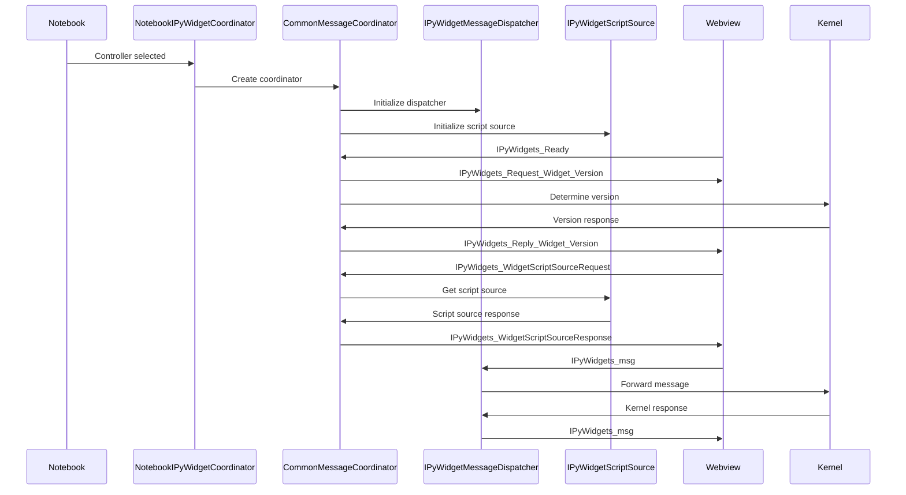

## Integration with @jupyterlab/services

The IPyWidgets system heavily relies on the `@jupyterlab/services` package for kernel communication:

### Key Integration Points

#### Message Serialization (`ipyWidgetMessageDispatcher.ts`)

```typescript
import { KernelMessage } from '@jupyterlab/services';
import { deserialize } from '@jupyterlab/services/lib/kernel/serialize';

// Message deserialization
const msg = deserialize(data, protocol) as KernelMessage.IMessage;

// Type-safe message handling
if (jupyterLab.KernelMessage.isDisplayDataMsg(msg)) {
    this._onDisplayMessage.fire(msg);
}
```

#### Kernel Connection Management

```typescript
import { IKernelConnection } from '@jupyterlab/services/lib/kernel/kernel';

// Comm target registration
kernel.registerCommTarget(targetName, callback);

// Message hook registration
kernel.registerMessageHook(msgId, callback);
```

#### Message Type Validation

```typescript
import { IDisplayDataMsg, IIOPubMessage } from '@jupyterlab/services/lib/kernel/messages';

// Type-safe message processing
if (KernelMessage.isDisplayDataMsg(msg)) {
    this.trackModelId(notebook, msg);
}
```

### Critical @jupyterlab/services Dependencies

The system depends on several key modules from `@jupyterlab/services`:

#### Kernel Management (`/kernel/`)

-   **`kernel.ts`**: Core kernel interface and connection management
-   **`messages.ts`**: Message type definitions and validation
-   **`serialize.ts`**: Message serialization/deserialization
-   **`manager.ts`**: Kernel manager functionality

#### Session Management (`/session/`)

-   **`session.ts`**: Session management and lifecycle
-   **`manager.ts`**: Session manager for connection handling

#### Server Connection (`serverConnection.ts`)

-   Handles HTTP/WebSocket connections to Jupyter servers
-   Manages authentication and connection state

## Architecture Deep Dive

### 1. IPyWidgets Protocol Implementation

#### Comm System Architecture

VS Code implements the complete IPyWidgets comm protocol as a transparent bridge:

**Protocol Requirements**:

-   Symmetric, asynchronous messaging between kernel and frontend
-   JSON-serializable message blobs with GUID-based routing
-   Target-based comm registration and lifecycle management
-   Bidirectional state synchronization without single source of truth

**VS Code Implementation**:

```typescript
// Extension acts as comm broker
kernel.registerCommTarget('jupyter.widget', (comm, msg) => {
    // Forward comm lifecycle to webview
    webview.postMessage({
        type: 'comm_open',
        comm_id: comm.id,
        target: comm.target_name,
        data: msg.content.data
    });
});

// Handle bidirectional comm messages
comm.onMsg = (msg) => {
    webview.postMessage({ type: 'comm_msg', comm_id: comm.id, msg });
};
```

#### Model-View Architecture

Implements the standard IPyWidgets Model-View pattern with VS Code adaptations:

**Standard Protocol**:

-   WidgetModel (1) ↔ WidgetView (N) relationship
-   State synchronization via trait system with `sync=True` metadata
-   Display association via execution message GUID tracking

**VS Code Specific Handling**:

```typescript
// Cell-specific view binding
onDisplayData(msg: IDisplayDataMsg) {
    const parentExecutionId = msg.parent_header.msg_id;
    const targetCell = this.findCellByExecutionId(parentExecutionId);

    // Create view in specific cell output
    const view = await this.widgetManager.display_model(model, targetCell);
}
```

### 2. State Synchronization and Serialization

#### Trait-Based Synchronization

IPyWidgets uses a trait system for automatic state synchronization:

**Python Side**:

```python
class MyWidget(DOMWidget):
    _view_module = Unicode('mywidget').tag(sync=True)
    _view_name = Unicode('MyWidgetView').tag(sync=True)
    count = Int().tag(sync=True)  # Automatically synchronized
```

**JavaScript Side**:

```javascript
var MyWidgetView = widgets.DOMWidgetView.extend({
    initialize: function () {
        // Listen for model changes
        this.listenTo(this.model, 'change:count', this._count_changed);
    },
    _count_changed: function () {
        // Update view based on model change
        this.el.textContent = this.model.get('count');
    }
});
```

#### Custom Serialization Protocol

Advanced widgets require custom serialization for complex data types:

**Widget Reference Serialization**:

```python
# Widget objects serialized as string references
children = Tuple().tag(sync=True, **widget_serialization)
# Results in: ["IPY_MODEL_<widget_id>", ...]
```

**Frontend Resolution**:

```typescript
// Resolve widget references to actual models
static serializers = {
    children: {
        deserialize: (value: string[]) => {
            return value.map(id => this.widget_manager.get_model(id));
        }
    }
}
```

### 3. Dynamic Widget Loading System

#### RequireJS Integration

VS Code uses RequireJS for dynamic widget module loading:

**Module Loading Hierarchy**:

1. Check RequireJS registry for cached modules
2. Query local Python environment nbextensions
3. Request from remote Jupyter server
4. Fallback to CDN sources (unpkg.com, jsdelivr.com)

**Loading Implementation**:

```typescript
async loadWidgetScript(moduleName: string, version: string): Promise<void> {
    // Check cache first
    if (this.isModuleLoaded(moduleName)) return;

    // Try script providers in order
    for (const provider of this.scriptProviders) {
        try {
            const script = await provider.getWidgetScript(moduleName, version);
            await this.loadScript(script);
            return;
        } catch (error) {
            // Try next provider
        }
    }

    throw new Error(`Failed to load widget module: ${moduleName}`);
}
```

#### Script Source Providers

Multiple providers ensure widget availability across deployment scenarios:

**Provider Types**:

-   **LocalWidgetScriptSourceProvider**: Local nbextensions directory
-   **RemoteWidgetScriptSourceProvider**: Remote Jupyter server
-   **CDNWidgetScriptSourceProvider**: Public CDN fallback

### 4. Execution Context and Display Protocol

#### Cell-Widget Association

Widgets must be associated with specific notebook cells for proper display:

**Execution Flow**:

1. User executes cell containing widget code
2. VS Code sends execute_request with unique message ID
3. Kernel executes code and creates widget instance
4. Widget display triggers display_data message with parent execution ID
5. VS Code associates widget with originating cell

**Implementation**:

```typescript
// Mirror execution requests to maintain context
mirrorExecuteRequest(msg: IExecuteRequestMsg) {
    // Send mirrored request to webview without actual execution
    // Maintains execution context for widget display
    this.webview.postMessage({
        type: 'mirror_execute',
        msg: msg,
        parentId: msg.header.msg_id
    });
}
```

#### Widget Display Lifecycle

Complete widget lifecycle from creation to disposal:

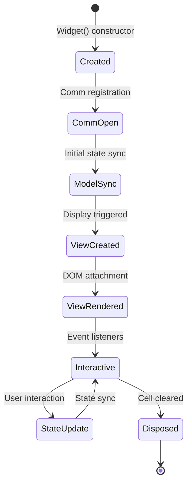

## High-Level Workflows

### 1. IPyWidgets Initialization and Script Loading

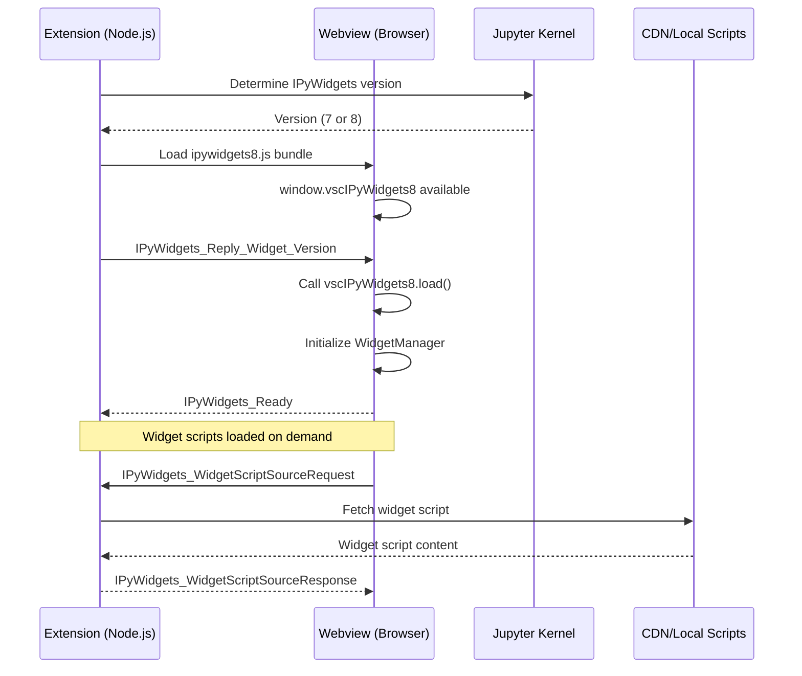

### 2. Kernel Hook System and Message Interception

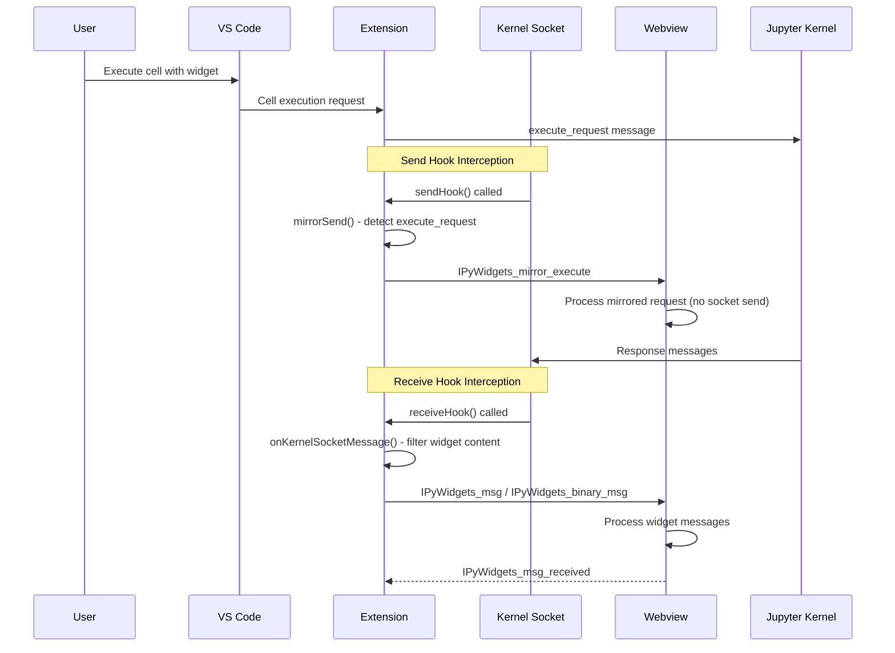

### 3. Widget Class Loading and Script Resolution

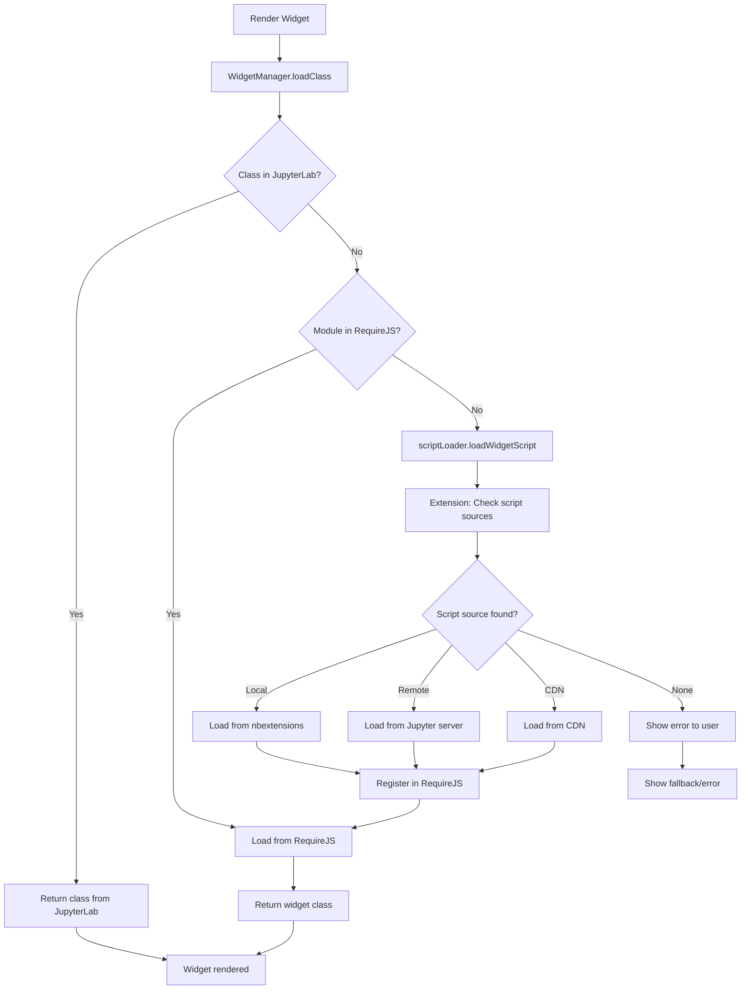

### 4. Output Widget Hook Management

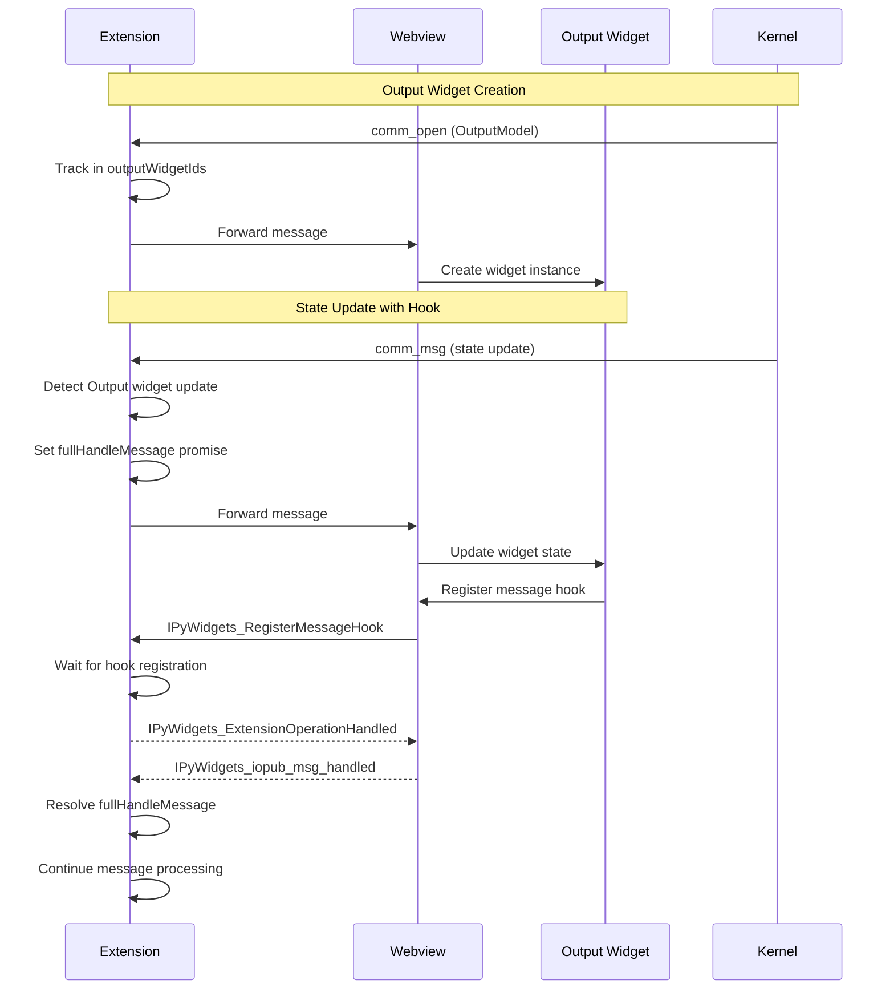

### 5. Comm Target Registration Flow

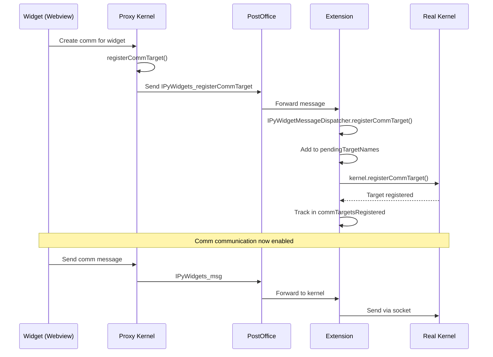

### 6. Standalone Package Integration Workflow

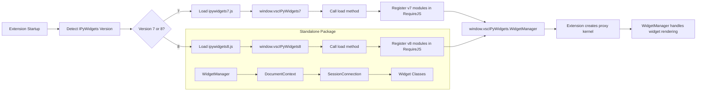

### Widget Loading Workflow

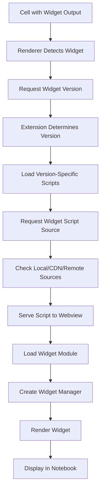

### Kernel Communication Workflow

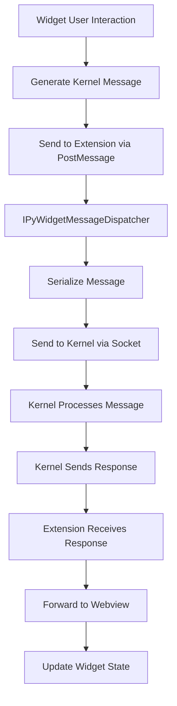

### Script Source Resolution Workflow

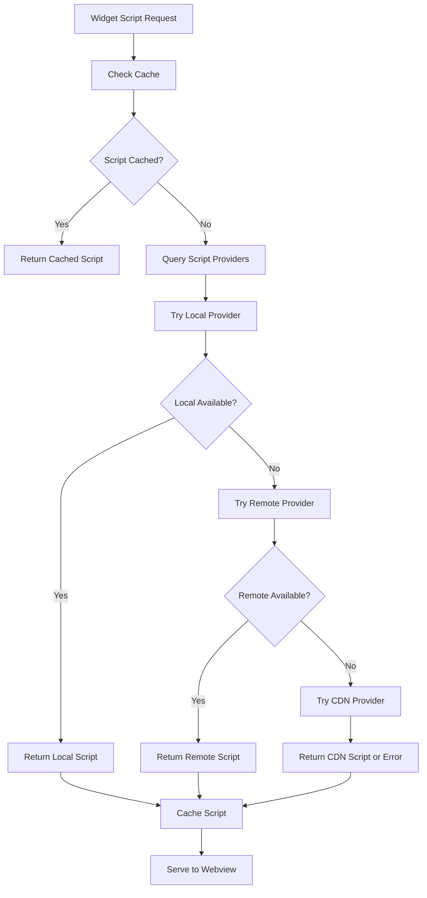

## Integration with @jupyterlab/services

The IPyWidgets system heavily relies on the `@jupyterlab/services` package for Jupyter protocol compatibility. This integration enables seamless communication with Jupyter kernels while maintaining type safety and protocol compliance.

### Key Integration Points

#### 1. Message Serialization and Deserialization

**File**: `@jupyterlab/services/lib/kernel/serialize`

```typescript
// Extension side - deserializing incoming messages
import { deserialize } from '@jupyterlab/services/lib/kernel/serialize';
const msg = deserialize(data, protocol) as KernelMessage.IMessage;

// Webview side - creating proxy kernel with proper serialization
const settings = ServerConnection.makeSettings({
    WebSocket: ProxyWebSocket as any,
    wsUrl: 'BOGUS_PVSC'
});
```

**Critical Usage**:

-   Protocol-aware message deserialization
-   Binary data handling for widget state
-   Message validation and type checking
-   Cross-platform compatibility (Node.js vs Browser)

#### 2. Kernel Connection Management

**File**: `@jupyterlab/services/lib/kernel/default`

```typescript
// Webview side - creating proxy kernel connection
import { KernelConnection } from '@jupyterlab/services/lib/kernel/default';

this.realKernel = new KernelConnection({
    serverSettings: settings,
    clientId: options.clientId,
    handleComms: true,
    username: options.userName,
    model: options.model
});
```

**Critical Features**:

-   Full `Kernel.IKernelConnection` interface implementation
-   Comm target registration and management
-   Message hook system integration
-   Future and promise-based message handling

#### 3. Message Type Validation and Processing

**File**: `@jupyterlab/services/lib/kernel/messages`

```typescript
// Type-safe message handling
import { KernelMessage } from '@jupyterlab/services';

if (KernelMessage.isDisplayDataMsg(msg)) {
    this._onDisplayMessage.fire(msg as IDisplayDataMsg);
}

if (KernelMessage.isCommOpenMsg(msg) || KernelMessage.isCommCloseMsg(msg) || KernelMessage.isCommMsgMsg(msg)) {
    // Handle comm messages
}
```

**Message Types Used**:

-   `IExecuteRequestMsg` / `IExecuteReplyMsg` - Code execution
-   `IDisplayDataMsg` / `IUpdateDisplayDataMsg` - Widget output
-   `ICommOpenMsg` / `ICommCloseMsg` / `ICommMsgMsg` - Widget communication
-   `IIOPubMessage` - Kernel output messages

#### 4. Server Connection and WebSocket Management

**File**: `@jupyterlab/services/lib/serverconnection`

```typescript
// Creating server settings for proxy kernel
import { ServerConnection } from '@jupyterlab/services';

const settings = ServerConnection.makeSettings({
    WebSocket: ProxyWebSocket as any,
    wsUrl: 'BOGUS_PVSC',
    token: '',
    appUrl: ''
});
```

**Configuration**:

-   Custom WebSocket implementation for message bridging
-   Authentication and authorization handling
-   Base URL and endpoint configuration
-   Request/response interceptors

#### 5. Comm System Integration

**File**: `@jupyterlab/services/lib/kernel/comm`

```typescript
// Comm creation and management
public async _create_comm(
    target_name: string,
    model_id: string,
    data?: any,
    metadata?: any
): Promise<shims.services.Comm> {
    const comm = this.kernel.createComm(target_name, model_id);
    if (data || metadata) {
        comm.open(data, metadata);
    }
    return Promise.resolve(new shims.services.Comm(comm));
}
```

**Comm Features**:

-   Target-based communication channels
-   Bidirectional message passing
-   State synchronization between extension and webview
-   Message queuing and delivery guarantees

### Critical Dependencies

The IPyWidgets system depends on these specific @jupyterlab/services modules:

#### Core Kernel Module (`/kernel/**/*.ts`)

-   `kernel/default.ts` - `KernelConnection` class
-   `kernel/kernel.ts` - Core interfaces and types
-   `kernel/messages.ts` - Message type definitions
-   `kernel/serialize.ts` - Message serialization utilities
-   `kernel/comm.ts` - Communication channel management

#### Session Management (`/session/**/*.ts`)

-   `session/session.ts` - Session interface definitions
-   `session/manager.ts` - Session lifecycle management

#### Server Connection (`/serverconnection.ts`)

-   WebSocket configuration and management
-   Authentication and request handling
-   Base URL and endpoint resolution

#### Manager Module (`/manager.ts`)

-   Service manager for coordinating kernel and session services
-   Resource lifecycle management
-   Configuration and settings management

## Development Patterns and Best Practices

###  Widget Development Guidelines

Refer to [anywidget](https://anywidget.dev/en/getting-started/) for widget development guides.

```
pip install anywidget
```

```python
import anywidget
import traitlets

class CounterWidget(anywidget.AnyWidget):
    _esm = """
    function render({ model, el }) {
      let button = document.createElement("button");
      button.innerHTML = `count is ${model.get("value")}`;
      button.addEventListener("click", () => {
        model.set("value", model.get("value") + 1);
        model.save_changes();
      });
      model.on("change:value", () => {
        button.innerHTML = `count is ${model.get("value")}`;
      });
      el.classList.add("counter-widget");
      el.appendChild(button);
    }
    export default { render };
    """
    _css = """
    .counter-widget button { color: white; font-size: 1.75rem; background-color: #ea580c; padding: 0.5rem 1rem; border: none; border-radius: 0.25rem; }
    .counter-widget button:hover { background-color: #9a3412; }
    """
    value = traitlets.Int(0).tag(sync=True)

CounterWidget(value=42)
```

### Debugging Techniques

Effective debugging approaches for widget issues:

**Message Tracing**:

```typescript
// Enable Trace logging in Jupyter extension and inspect logs
```

**State Inspection**:

```python
# Debug widget state synchronization
def debug_trait_change(change):
    print(f"Trait {change['name']} changed: {change['old']} -> {change['new']}")

widget.observe(debug_trait_change, names=['count', 'message'])
```


This comprehensive documentation ensures robust IPyWidgets implementation that maintains compatibility across different environments while providing excellent user experience in VS Code.
