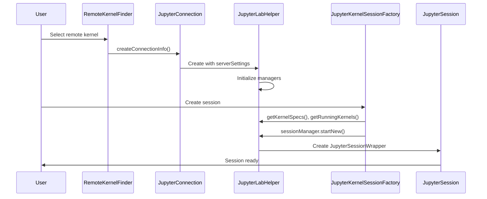
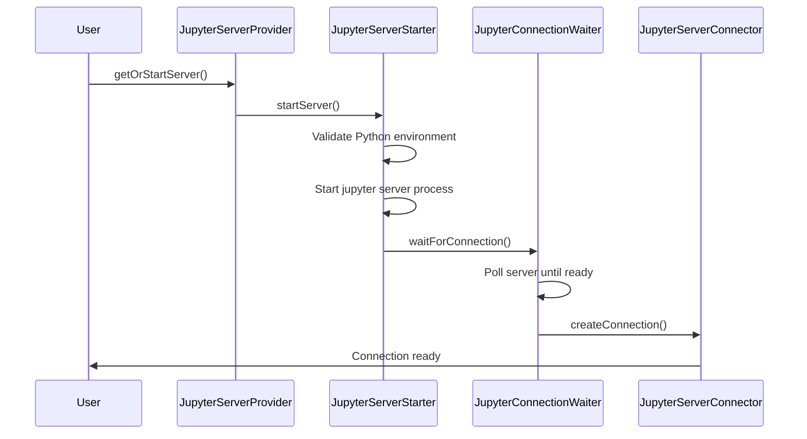
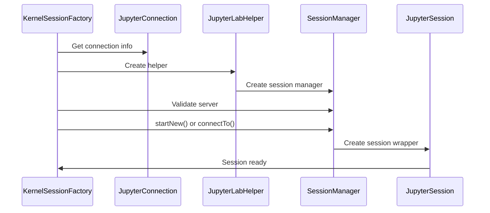

# Jupyter Kernel System Architecture

The `src/kernels/jupyter` directory contains the core components responsible for managing Jupyter protocol-based kernel connections, sessions, and communication in the VS Code Jupyter extension. This system provides the interface between the extension and remote/local Jupyter servers using the `@jupyterlab/services` npm package.

## Project Structure and Organization

The Jupyter kernel system follows a service-oriented architecture with clear separation of concerns:

```
src/kernels/jupyter/
├── types.ts                           # Core Jupyter-specific interfaces
├── types.node.ts                      # Node.js-specific interfaces
├── jupyterKernelSpec.ts               # Kernel specification wrapper
├── jupyterUtils.ts                    # Common Jupyter utilities
├── helpers.ts                         # Helper functions
├── constants.ts                       # System constants
├── clearJupyterServersCommand.ts      # Clear server cache command
├── serviceRegistry.{node,web}.ts      # Dependency injection registration
├── connection/                        # Server connection management
├── launcher/                          # Server and kernel launching
├── session/                           # Session and kernel management
├── finder/                            # Remote kernel discovery
└── interpreter/                       # Jupyter environment validation
```

## Core Components

### 1. Connection Management (`connection/`)

**Purpose**: Manages connections to Jupyter servers and validates server connectivity.

**Key Components**:

- **`JupyterConnection`**: Primary interface for establishing server connections
  - Handles authentication (token, password, certificates)
  - Creates and validates `ServerConnection.ISettings` objects
  - Manages connection caching and reuse

- **`JupyterServerProviderRegistry`**: Registry for server providers
  - Manages third-party server providers (local, remote, cloud)
  - Handles provider discovery and selection

- **`JupyterRemoteCachedKernelValidator`**: Validates cached remote kernels
  - Ensures cached kernel connections are still valid
  - Handles connection timeout and retry logic

- **`LiveRemoteKernelConnectionTracker`**: Tracks usage of live remote kernels
  - Monitors when users connect to existing kernels
  - Provides telemetry on kernel reuse patterns

- **`ServerUriStorage`**: Persists server URIs and connection info
  - Stores recent server connections
  - Handles MRU (Most Recently Used) server lists

**Connection Workflow**:
1. User selects remote server or system detects local server
2. `JupyterConnection.createConnectionInfo()` establishes connection
3. Connection settings cached for reuse
4. Validation ensures server is accessible and responsive

### 2. Session Management (`session/`)

**Purpose**: Creates and manages Jupyter sessions and kernels using `@jupyterlab/services`.

**Key Components**:

- **`JupyterLabHelper`**: Central wrapper around `@jupyterlab/services`
  - Creates `SessionManager`, `KernelManager`, `KernelSpecManager`, `ContentsManager`
  - Provides unified interface to JupyterLab services
  - Handles service lifecycle and disposal

- **`JupyterKernelSessionFactory`**: Factory for creating kernel sessions
  - Implements `IKernelSessionFactory` interface
  - Orchestrates session creation workflow
  - Handles dependency validation and error recovery

- **`JupyterSessionWrapper`**: Wrapper around `Session.ISessionConnection`
  - Implements `IJupyterKernelSession` interface
  - Provides extension-specific session management
  - Handles restart, shutdown, and idle detection logic

- **`JupyterKernelService`**: Kernel specification management
  - Handles kernel spec registration and updates
  - Validates kernel dependencies (ipykernel, etc.)
  - Creates temporary kernel specs for non-standard kernels

- **`JupyterRequestCreator`**: HTTP request factory
  - Creates authenticated requests to Jupyter servers
  - Handles different authentication methods
  - Platform-specific implementations (Node.js vs Web)

**Session Creation Workflow**:
1. `JupyterKernelSessionFactory.create()` initiated
2. Connection to Jupyter server established via `JupyterConnection`
3. `JupyterLabHelper` created with server settings
4. Session manager validates remote server capabilities
5. New session created or existing session connected to
6. `JupyterSessionWrapper` wraps the session for extension use
7. Session ready for kernel communication

### 3. Server Launching (`launcher/`)

**Purpose**: Starts and manages local Jupyter servers when needed.

**Key Components**:

- **`JupyterServerProvider`**: Main server lifecycle manager
  - Starts local Jupyter servers on demand
  - Manages server ports and configuration
  - Handles server shutdown and cleanup

- **`JupyterServerStarter`**: Server startup orchestration
  - Validates Python environment has Jupyter installed
  - Manages server startup parameters and arguments
  - Handles startup timeouts and error recovery

- **`JupyterServerConnector`**: Server connection establishment
  - Waits for server to become available
  - Validates server is responding correctly
  - Creates initial connection settings

- **`JupyterServerHelper`**: Server management utilities
  - Server process management
  - Port allocation and validation
  - Server health monitoring

- **`JupyterConnectionWaiter`**: Connection readiness detection
  - Polls server until ready for connections
  - Handles authentication token retrieval
  - Manages connection timeouts

**Server Startup Workflow**:
1. User action requires Jupyter server (local kernels)
2. `JupyterServerProvider.getOrStartServer()` called
3. `JupyterServerStarter` validates environment and starts server
4. `JupyterConnectionWaiter` waits for server availability
5. `JupyterServerConnector` establishes connection
6. Server connection cached for reuse

### 4. Kernel Discovery (`finder/`)

**Purpose**: Discovers available kernels on Jupyter servers.

**Key Components**:

- **`RemoteKernelFinder`**: Remote kernel discovery
  - Implements `IContributedKernelFinder` interface
  - Discovers kernels via Jupyter REST API
  - Provides quick pick interface for kernel selection

- **`RemoteKernelFinderController`**: Discovery coordination
  - Manages multiple remote server connections
  - Caches discovered kernels for performance
  - Handles server connection failures gracefully

**Discovery Workflow**:
1. `RemoteKernelFinder.kernels` property accessed
2. REST API calls to `/api/kernelspecs` and `/api/kernels`
3. Running kernels and available specs discovered
4. Kernel metadata created for each discovered kernel
5. Results cached and updated on server changes

### 5. Environment Validation (`interpreter/`)

**Purpose**: Validates Jupyter dependencies in Python environments.

**Key Components**:

- **`JupyterInterpreterDependencyManager`**: Dependency validation
  - Checks for required packages (jupyter, ipykernel, etc.)
  - Prompts for installation when packages missing
  - Handles different package managers (pip, conda)

- **`NbConvertInterpreterDependencyChecker`**: Export dependency validation
  - Validates nbconvert availability for export features
  - Handles platform-specific export requirements

## Integration with @jupyterlab/services

The Jupyter extension heavily relies on the `@jupyterlab/services` npm package for Jupyter protocol communication. Key integration points:

### Core Services Used

1. **`ServerConnection`** (`serverConnection.ts`):
   - Manages HTTP connection settings
   - Handles authentication (token, password)
   - Provides request/response utilities

2. **`SessionManager`** (`session/manager.ts`):
   - Creates and manages Jupyter sessions
   - Provides session lifecycle management
   - Handles session discovery and connection

3. **`KernelManager`** (`kernel/manager.ts`):
   - Manages kernel instances and lifecycle
   - Provides kernel discovery and connection
   - Handles kernel communication protocols

4. **`KernelSpecManager`** (`kernelspec/`):
   - Discovers available kernel specifications
   - Provides kernel metadata and capabilities
   - Handles kernel spec refresh and updates

5. **`ContentsManager`** (`contents/`):
   - Manages notebook file operations
   - Provides file system abstraction
   - Handles notebook metadata

### Message Protocol Integration

The extension uses `@jupyterlab/services` for Jupyter messaging protocol:

- **Kernel Messages**: `KernelMessage.IMessage` types for all communication
- **Execution Requests**: Code execution via `kernel.requestExecute()`
- **Comm Messages**: Widget communication via comm channels
- **Status Updates**: Kernel status monitoring via message streams

### Service Manager Pattern

The extension follows the JupyterLab service manager pattern:

```typescript
// Core service creation in JupyterLabHelper
this.kernelSpecManager = new this.jupyterlab.KernelSpecManager({ serverSettings });
this.kernelManager = new this.jupyterlab.KernelManager({ serverSettings });
this.sessionManager = new this.jupyterlab.SessionManager({
    serverSettings,
    kernelManager: this.kernelManager
});
this.contentsManager = new this.jupyterlab.ContentsManager({ serverSettings });
```

## Major Workflows

### Remote Kernel Connection Workflow



### Local Server Startup Workflow



### Kernel Session Creation Workflow



## High-Level Operations

### Starting a Remote Kernel

1. `RemoteKernelFinder` discovers available kernels via REST API
2. User selects kernel from Quick Pick interface
3. `JupyterConnection` creates connection to server
4. `JupyterKernelSessionFactory` validates server and creates session
5. `JupyterSessionWrapper` wraps session for extension use
6. Kernel ready for code execution

### Managing Server Connections

1. Server providers register with `JupyterServerProviderRegistry`
2. Connection URIs stored in `ServerUriStorage` for persistence
3. `JupyterConnection` handles authentication and creates settings
4. Connections cached and reused across sessions
5. `LiveRemoteKernelConnectionTracker` monitors usage patterns

### Handling Session Lifecycle

1. Sessions created via `JupyterKernelSessionFactory`
2. `JupyterLabHelper` manages underlying service objects
3. `JupyterSessionWrapper` provides extension-specific behaviors
4. Session status monitored via kernel message streams
5. Cleanup handled automatically on disposal

## Error Handling and Recovery

### Connection Errors

- **`RemoteJupyterServerConnectionError`**: Server unreachable or authentication failed
- **`JupyterSelfCertsError`**: Self-signed certificate issues
- **`LocalJupyterServerConnectionError`**: Local server startup failures

### Session Errors

- **`JupyterSessionStartError`**: Session creation failures
- **`SessionDisposedError`**: Operations on disposed sessions
- **`JupyterInvalidKernelError`**: Invalid kernel specifications

### Recovery Strategies

- Automatic retry with exponential backoff
- Fallback to alternative connection methods
- Graceful degradation when services unavailable
- User-friendly error messages with actionable suggestions

## Platform-Specific Implementations

### Node.js Environment

- Full `@jupyterlab/services` functionality
- Local server startup and management
- File system access for kernel specs
- Process management for server lifecycle

### Web Environment

- Limited to remote server connections
- No local server startup capabilities
- WebSocket-only communication
- Reduced kernel discovery options

## Performance Optimizations

### Caching Strategies

- **Server connections**: Reuse connection settings across sessions
- **Kernel specs**: Cache discovered kernel specifications
- **Session objects**: Pool session managers for efficiency

### Lazy Loading

- Services created only when needed
- Server connections established on demand
- Kernel discovery triggered by user actions

### Resource Management

- Automatic disposal of unused sessions
- Connection pooling for remote servers
- Memory cleanup on extension deactivation

## Development Guidelines

When working with Jupyter kernel code:

### Adding New Server Types

1. Implement server provider interface
2. Register with `JupyterServerProviderRegistry`
3. Handle authentication and connection specifics
4. Add error handling for connection failures
5. Update service registration files

### Extending Session Management

1. Consider platform differences (Node.js vs Web)
2. Use `@jupyterlab/services` APIs consistently
3. Implement proper session lifecycle management
4. Add telemetry for usage tracking
5. Handle edge cases (timeouts, network failures)

### @jupyterlab/services Best Practices

1. **Service Manager Pattern**: Always use manager classes for lifecycle
2. **Proper Disposal**: Call `dispose()` on all service objects
3. **Error Handling**: Wrap service calls with appropriate error handling
4. **Async Operations**: Use proper cancellation token support
5. **Connection Sharing**: Reuse `ServerConnection.ISettings` when possible

### Integration Patterns

1. **Dependency Injection**: Use service registry for component creation
2. **Event-driven Updates**: Listen to service manager signals
3. **Promise Monitoring**: Track async operations for proper cleanup
4. **Cancellation Support**: Respect `CancellationToken` in all operations

### Testing Considerations

- Mock `@jupyterlab/services` components for unit tests
- Use real Jupyter servers for integration tests
- Test both success and failure scenarios
- Verify session cleanup and resource disposal

### Common Anti-patterns to Avoid

1. **Direct Service Creation**: Always use managers and factories
2. **Shared State**: Avoid global service instances
3. **Resource Leaks**: Always dispose of sessions and managers
4. **Blocking Operations**: Use async patterns consistently
5. **Ignoring Errors**: Handle all service errors appropriately

## Interaction with Other Systems

### Kernel Provider Integration

- `JupyterKernelSessionFactory` implements `IKernelSessionFactory`
- Sessions provided to kernel provider for execution
- Lifecycle managed through kernel provider callbacks

### Notebook Controller Integration

- Sessions bound to VS Code notebook documents
- Execution routed through session message handlers
- Status updates propagated to notebook UI

### Extension API Integration

- Server providers contributed by other extensions
- Kernel discovery extended through finder registry
- Authentication handled through provider interfaces

This architecture provides a robust, scalable foundation for Jupyter protocol communication that leverages the full power of `@jupyterlab/services` while providing VS Code-specific enhancements and error handling.
