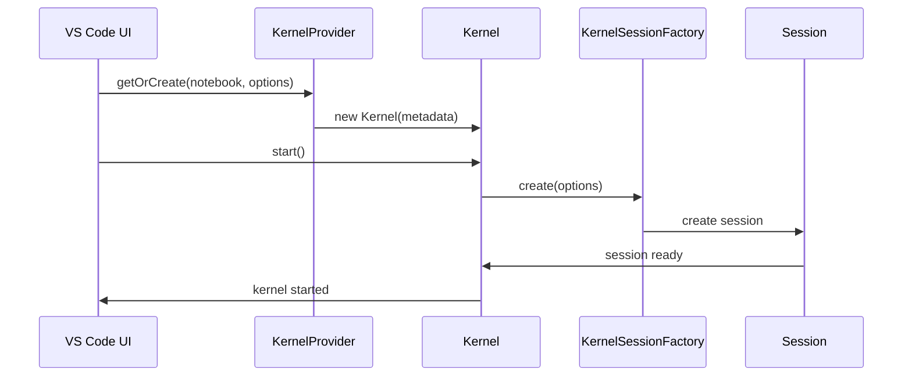
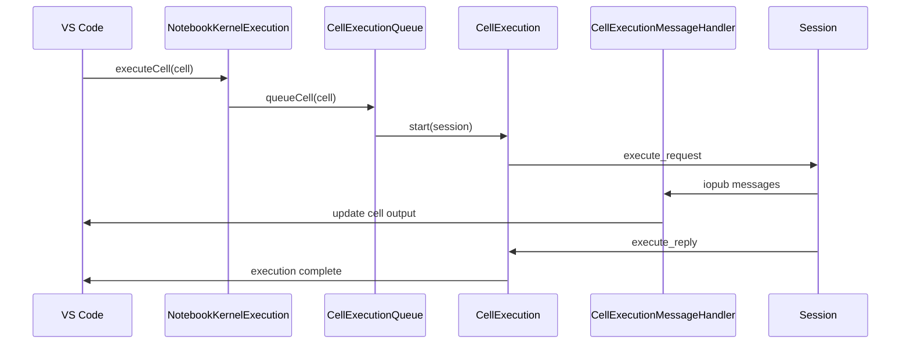
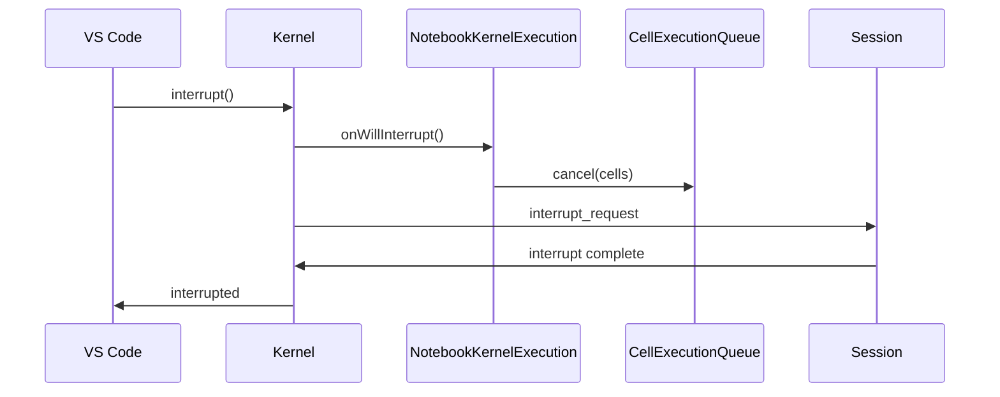
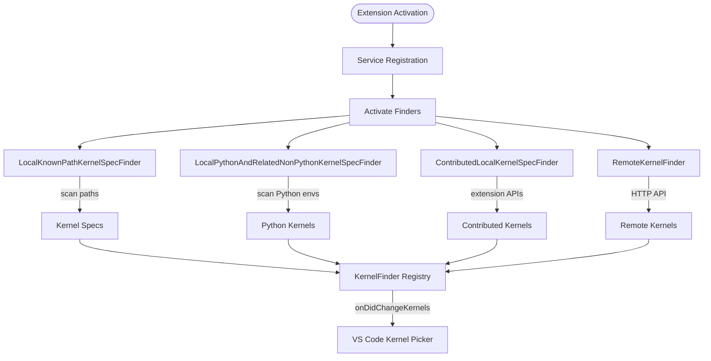
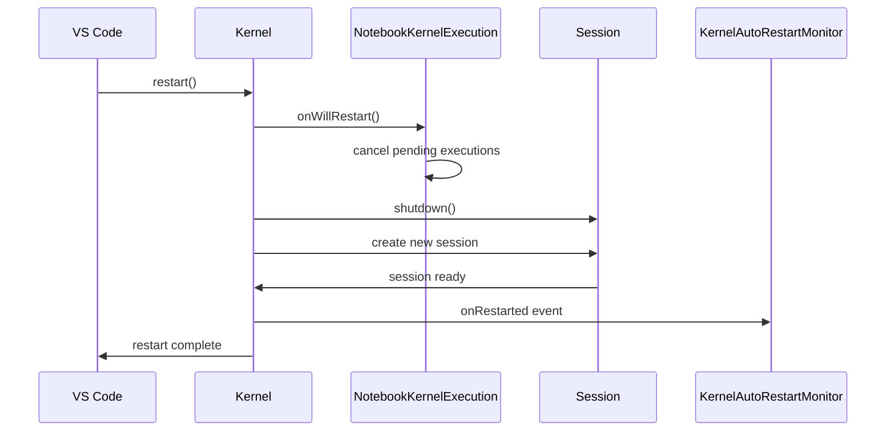

# Kernel System Architecture

The `src/kernels` directory contains the core components responsible for kernel management, discovery, execution, and communication in the Jupyter extension. This system enables the execution of code in notebooks and interactive windows through various kernel types (local Python kernels, remote Jupyter kernels, raw kernels, etc.).

## Project Structure and Organization

The kernel system follows a hierarchical architecture with clear separation of concerns:

```
src/kernels/
├── types.ts                           # Core interfaces and types
├── kernel.ts                          # Base kernel implementation
├── kernelProvider.{base,node,web}.ts  # Kernel provider implementations
├── kernelFinder.ts                    # Central kernel discovery registry
├── kernelController.ts                # VS Code notebook controller wrapper
├── kernelExecution.ts                 # Notebook-level execution management
├── serviceRegistry.{node,web}.ts      # Dependency injection registration
├── execution/                         # Cell execution management
├── jupyter/                           # Jupyter server integration
├── raw/                              # Direct kernel process management
├── common/                           # Shared utilities and base classes
├── errors/                           # Error handling and types
├── variables/                        # Variable inspection and data viewer
├── telemetry/                        # Usage analytics
└── chat/                             # Chat integration features
```

## Core Components

### 1. Connection Metadata System (`types.ts`)

Defines how kernels are identified and connected to through inheritance from `BaseKernelConnectionMetadata`:

-   **`LocalKernelSpecConnectionMetadata`**: Kernels launched using local kernel specs (JSON files)
-   **`RemoteKernelSpecConnectionMetadata`**: Kernels launched using kernel specs on remote Jupyter servers
-   **`LiveRemoteKernelConnectionMetadata`**: Connects to already running kernels on remote servers
-   **`PythonKernelConnectionMetadata`**: Kernels launched directly using Python interpreters

Each metadata type contains the necessary connection information (ports, executable paths, authentication tokens, etc.).

### 2. Kernel Discovery (`kernelFinder.ts` + finders)

**Central Registry**: `KernelFinder` acts as the main registry for all kernel discovery mechanisms

**Finder Implementations**:

-   **`LocalKnownPathKernelSpecFinder`**: Scans standard Jupyter kernel spec directories
-   **`LocalPythonAndRelatedNonPythonKernelSpecFinder`**: Discovers Python environments and creates kernels
-   **`ContributedLocalKernelSpecFinder`**: Manages kernels contributed by VS Code extensions
-   **`RemoteKernelFinder`**: Discovers kernels on Jupyter servers via REST API

**Discovery Process**:

1. Each finder implements `IContributedKernelFinder` interface
2. Finders register with `KernelFinder` on startup
3. Event-driven updates when kernels are added/removed
4. Caching mechanisms to improve performance

### 3. Kernel Provider (`kernelProvider.base.ts`)

**Responsibilities**:

-   Creates and manages `IKernel` instances based on connection metadata
-   Tracks active kernels by `NotebookDocument`
-   Manages kernel lifecycle (start, restart, dispose)
-   Provides execution capabilities through `INotebookKernelExecution`

**Platform Variants**:

-   **Node.js** (`kernelProvider.node.ts`): Full file system access, raw kernel support
-   **Web** (`kernelProvider.web.ts`): Browser-compatible, remote kernels only

### 4. Kernel Implementation (`kernel.ts`)

**Base Classes**:

-   **`BaseKernel`**: Common functionality for all kernel types
-   **`Kernel`**: Standard Jupyter extension kernels
-   **`ThirdPartyKernel`**: Kernels created by other extensions

**Key Features**:

-   Session management through `IKernelSession`
-   Startup code execution (matplotlib setup, IPyWidgets detection)
-   Hook system for lifecycle events (willRestart, willInterrupt, etc.)
-   Status tracking and error handling

### 5. Execution System (`execution/`)

**Main Components**:

-   **`NotebookKernelExecution`**: Notebook-level execution coordinator
-   **`CellExecutionQueue`**: Manages sequential cell execution
-   **`CellExecution`**: Individual cell execution lifecycle
-   **`CellExecutionMessageHandler`**: Processes kernel messages and updates cell output

**Execution Flow**:

1. User triggers cell execution
2. `NotebookKernelExecution.executeCell()` called
3. Cell added to `CellExecutionQueue`
4. `CellExecution` manages individual cell lifecycle
5. `CellExecutionMessageHandler` processes kernel responses
6. Cell output updated in VS Code UI

### 6. Session Management (`common/`, `jupyter/session/`, `raw/session/`)

**Session Abstraction**: All kernel communication goes through `IKernelSession` interface

**Implementation Types**:

-   **Jupyter Sessions** (`jupyter/session/`): Standard Jupyter protocol over HTTP/WebSocket
-   **Raw Sessions** (`raw/session/`): Direct ZeroMQ communication with kernel processes

**Key Classes**:

-   **`BaseJupyterSession`**: Common Jupyter session functionality
-   **`JupyterSession`**: Jupyter server session implementation
-   **`RawJupyterSession`**: Direct kernel process session

## Kernel Types and Workflows

### Jupyter Kernels (`jupyter/`)

**Components**:

-   **Connection** (`connection/`): Server authentication, connection management
-   **Finder** (`finder/`): REST API kernel discovery
-   **Launcher** (`launcher/`): Kernel startup on Jupyter servers
-   **Session** (`session/`): HTTP/WebSocket communication

**Connection Workflow**:

1. `RemoteKernelFinder` discovers available kernels via Jupyter REST API
2. User selects kernel from picker
3. `JupyterKernelSessionFactory` creates session
4. `JupyterSession` manages HTTP/WebSocket communication
5. Kernel ready for execution

### Raw Kernels (`raw/`)

**Components**:

-   **Finder** (`finder/`): Local kernel spec discovery, Python environment scanning
-   **Launcher** (`launcher/`): Direct process spawning and port management
-   **Session** (`session/`): ZeroMQ socket communication

**Launch Workflow**:

1. `LocalKnownPathKernelSpecFinder` scans for kernel specs
2. `KernelLauncher` spawns kernel process with connection file
3. `RawKernelSessionFactory` creates ZeroMQ session
4. `RawJupyterSession` manages socket communication
5. Kernel ready for execution

### Python Kernels

**Special Handling**: Python kernels can be launched either as Jupyter kernels or raw kernels:

-   **Raw Mode**: Direct process spawn with ipykernel
-   **Jupyter Mode**: Registered as kernel spec with Jupyter server

**Selection Logic** (`kernelSessionFactory.ts`):

```typescript
if (rawKernelSupported && isLocalConnection && pythonKernel) {
    return rawKernelSessionFactory.create(options);
} else {
    return jupyterSessionFactory.create(options);
}
```

## High-Level Operations

### Starting a Kernel



### Executing a Cell



### Interrupting a Kernel



### Kernel Discovery Process



### Restart Workflow



## Monitoring and Reliability Components

### `KernelCrashMonitor`

-   **Purpose**: Detects kernel crashes and displays errors
-   **Triggers**: When kernel status changes to 'dead' or 'autorestarting'
-   **Actions**: Shows error messages, ends current cell execution

### `KernelAutoReConnectMonitor`

-   **Purpose**: Attempts to reconnect to lost remote kernels
-   **Triggers**: Network disconnections, server restarts
-   **Actions**: Periodic reconnection attempts with exponential backoff

### `KernelAutoRestartMonitor`

-   **Purpose**: Automatically restarts failed kernels
-   **Triggers**: Kernel process exits, Jupyter session errors
-   **Actions**: Transparent restart with state preservation

## Error Handling (`errors/`)

**Error Types**:

-   **`KernelDeadError`**: Kernel process has died
-   **`KernelConnectionTimeoutError`**: Failed to connect within timeout
-   **`KernelInterruptTimeoutError`**: Interrupt request timed out
-   **`JupyterInvalidKernelError`**: Invalid kernel specification
-   **`KernelDependencyError`**: Missing required packages

**Error Handler** (`kernelErrorHandler.ts`):

-   Platform-specific error handling (Node.js vs Web)
-   User-friendly error messages with actionable suggestions
-   Automatic dependency installation prompts

## Platform Differences

### Node.js Environment

-   **Raw kernel support**: Direct process spawning via `child_process`
-   **ZeroMQ communication**: Native socket bindings
-   **File system access**: Full kernel spec scanning
-   **Python environment discovery**: Integration with Python extension

### Web Environment

-   **Remote kernels only**: No local process spawning
-   **HTTP/WebSocket only**: No ZeroMQ support
-   **Limited file access**: Browser security restrictions
-   **Simplified discovery**: Server-provided kernel lists only

## Performance Optimizations

### Caching Strategies

-   **Kernel spec cache**: Reduces file system scanning
-   **Connection metadata cache**: Faster kernel picker population
-   **Session reuse**: Avoid unnecessary kernel restarts

### Lazy Loading

-   **Finder activation**: Only scan when needed
-   **Session creation**: Defer until actual execution
-   **Extension integration**: Load Python features on demand

## Development Guidelines

When working with kernel code:

### Adding New Kernel Types

1. Create connection metadata class inheriting from `BaseKernelConnectionMetadata`
2. Implement finder in appropriate subdirectory (`jupyter/` or `raw/`)
3. Register finder in `serviceRegistry.{node,web}.ts`
4. Add session implementation if needed
5. Update error handling for new failure modes

### Adding New Features

1. Consider platform differences (Node.js vs Web)
2. Use dependency injection for testability
3. Implement proper error handling and user feedback
4. Add telemetry for usage tracking
5. Follow the hook pattern for lifecycle events

### Testing Considerations

-   Mock kernel sessions for unit tests
-   Use real kernel processes for integration tests
-   Test both success and failure scenarios
-   Verify cross-platform compatibility

### Common Patterns

-   **Event-driven updates**: Use EventEmitter for state changes
-   **Promise monitoring**: Track async operations for cleanup
-   **Weak references**: Avoid memory leaks with notebook references
-   **Cancellation support**: Respect CancellationToken in all async operations

This architecture provides a robust, extensible foundation for kernel management that supports multiple kernel types, platforms, and execution modes while maintaining clean separation of concerns and comprehensive error handling.
