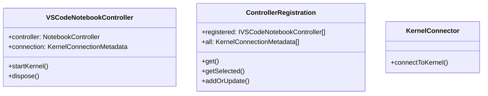
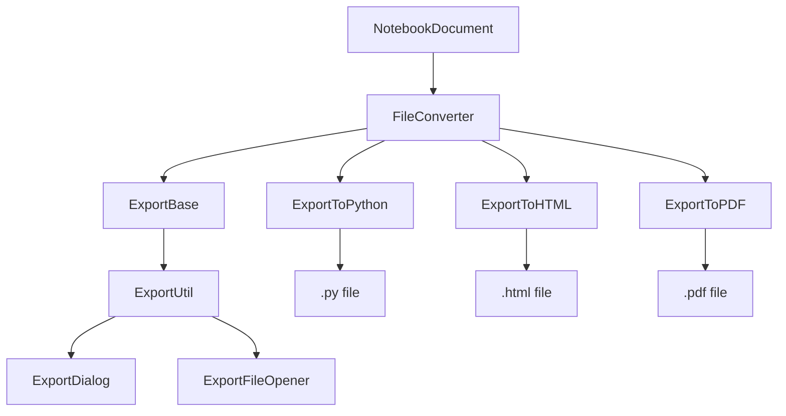
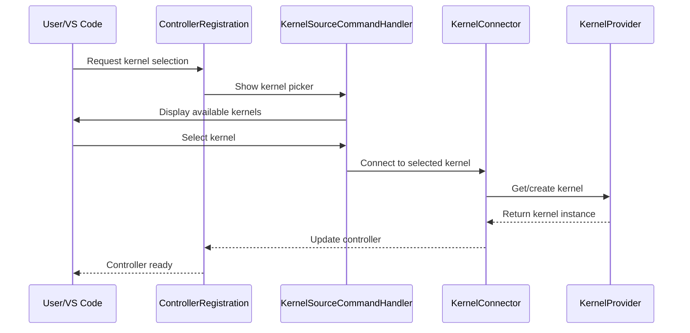
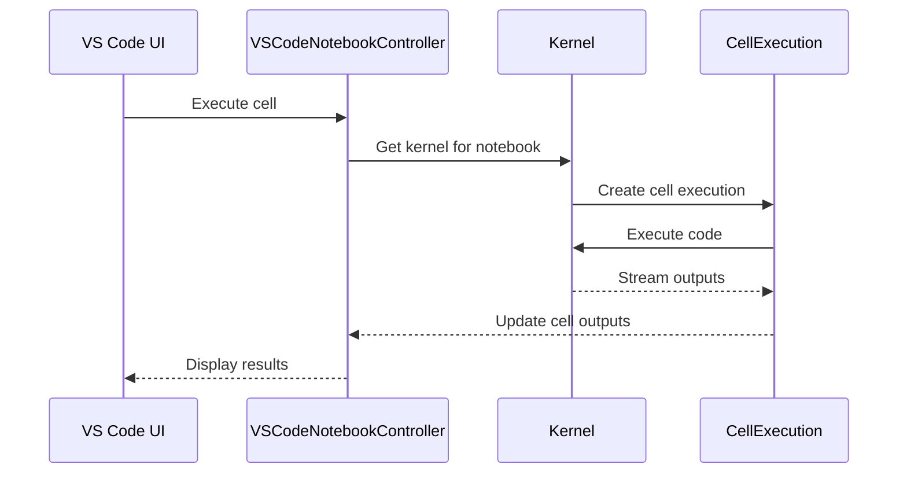
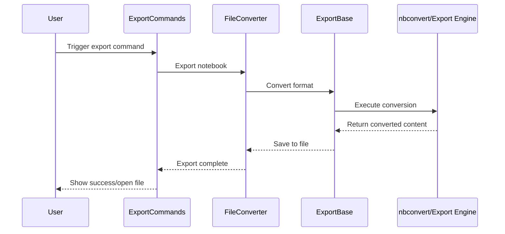
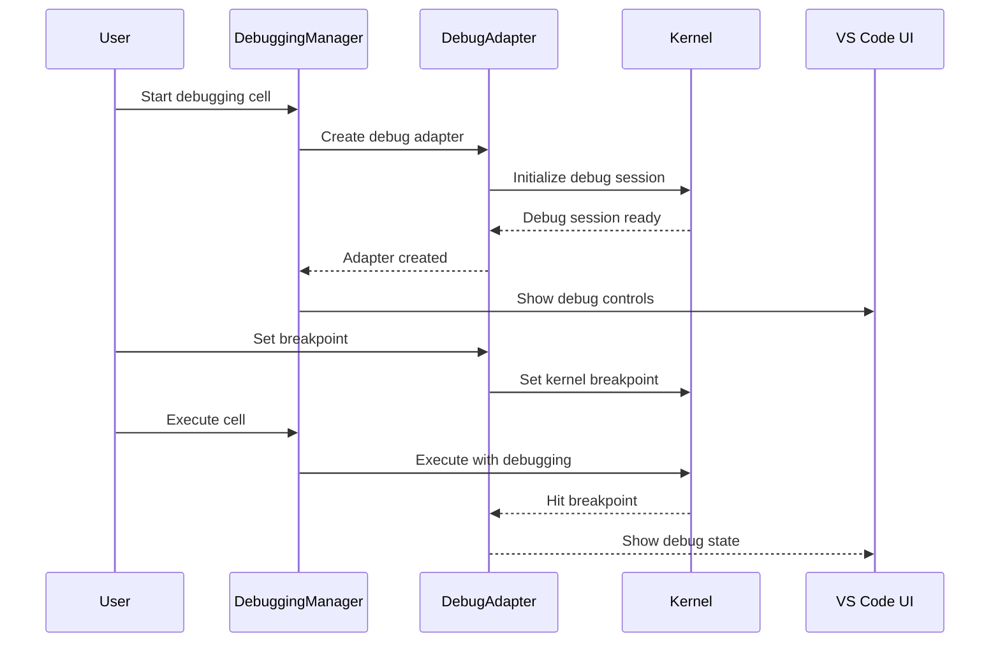
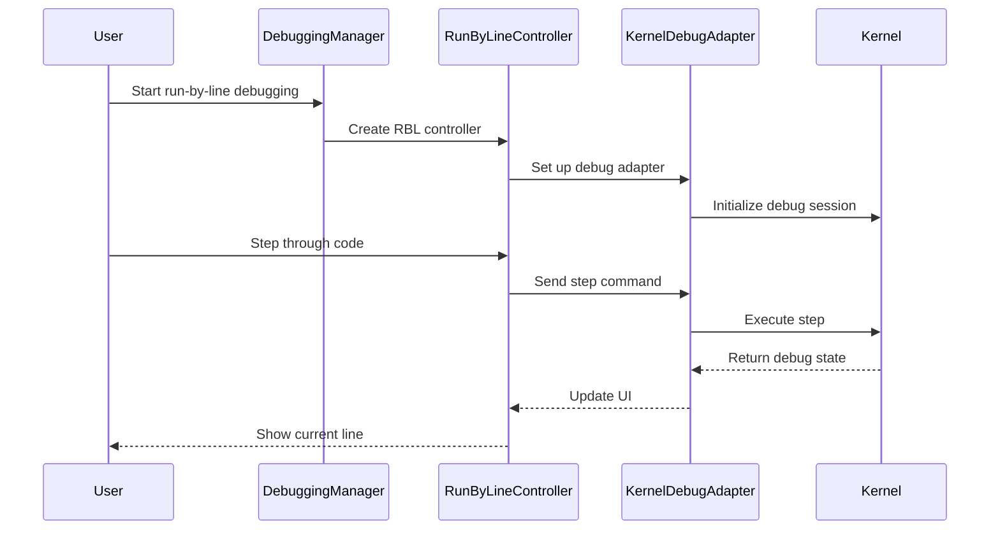

# Notebooks System Architecture

The `src/notebooks` directory contains the core components responsible for notebook management, control, execution, debugging, export capabilities, and output handling in the Jupyter extension. This system provides the bridge between VS Code's notebook API and the kernel execution layer.

Refer to https://code.visualstudio.com/api/extension-guides/notebook for detailed documentation on VS Code's notebook API.

## Core Components Overview

### Notebook Controllers (`controllers/`)

The controller system manages the lifecycle of notebook kernel connections and provides the interface between VS Code notebooks and kernel execution:

#### Core Controller Components

-   **`VSCodeNotebookController`**: The main implementation of VS Code's NotebookController API (wrapper around VS Codes `NotebookController`).
-   **`ControllerRegistration`**: Central registry for managing available notebook controllers
-   **`KernelConnector`**: Handles the connection process between notebooks and kernels
-   **`KernelSelector`**: Provides UI for selecting kernels for notebooks

#### Kernel Source Selection (`controllers/kernelSource/`)

The kernel source selection system provides specialized UI for different types of kernel connections:

-   **`LocalNotebookKernelSourceSelector`**: Selects local kernel specs
-   **`LocalPythonEnvNotebookKernelSourceSelector`**: Selects Python environments
-   **`RemoteNotebookKernelSourceSelector`**: Selects remote Jupyter kernels
-   **`KernelSourceCommandHandler`**: Coordinates kernel source selection UI

#### Connection Display and Management

-   **`ConnectionDisplayDataProvider`**: Formats kernel connection information for display
-   **`PreferredKernelConnectionService`**: Manages preferred kernel selections
-   **`RemoteKernelConnectionHandler`**: Handles remote kernel connection lifecycle

### Notebook Debugging (`debugger/`)

The debugging system provides comprehensive debugging support for notebook cells:

#### Core Debugging Components

-   **`DebuggingManager`**: Central manager for debugging sessions
-   **`KernelDebugAdapter`**: Bridges VS Code debug protocol with kernel debugging
-   **`DebugLocationTracker`**: Tracks execution location during debugging

#### Debugging Controllers (`debugger/controllers/`)

Specialized controllers for different debugging modes:

-   **`RunByLineController`**: Implements run-by-line debugging functionality
-   **`DebugCellController`**: Manages cell-level debugging
-   **`RestartController`**: Handles debug session restarts

#### Debug Services

-   **`JupyterDebugService`**: Provides Jupyter-specific debugging capabilities
-   **`MultiplexingDebugService`**: Manages multiple debug sessions
-   **`DebuggerVariables`**: Handles variable inspection during debugging

### Export System (`export/`)

The export system enables converting notebooks to various formats:

#### Export Architecture

#### Key Export Components

-   **`FileConverter`**: Main coordinator for export operations
-   **`ExportBase`**: Base class for export implementations (Node.js/Web variants)
-   **`ExportUtil`**: Utilities for export operations
-   **`ExportDialog`**: File picker UI for export destinations

#### Export Formats

-   **`ExportToPython`**: Converts notebooks to Python scripts
-   **`ExportToHTML`**: Exports notebooks as HTML documents
-   **`ExportToPDF`**: Generates PDF versions of notebooks
-   **`ExportInterpreterFinder`**: Finds appropriate Python environments for export

### Miscellaneous (`languages/`)

-   **`languages/NotebookCellLanguageService`**: Manages cell language identification and switching
-   **`languages/TracebackFormatter`**: Formats Python tracebacks for display

## Key Interfaces and Types

## Major Workflows

### Controller Selection and Connection Workflow

### Cell Execution Workflow

### Export Workflow

### Debugging Workflow

### Run-by-Line Debugging Workflow

## Component Interactions

### Controller Registration Flow

1. **Discovery**: `KernelFinder` discovers available kernels
2. **Filtering**: `PythonEnvironmentFilter` applies user preferences
3. **Registration**: `ControllerRegistration` creates controllers for valid kernels
4. **Display**: `ConnectionDisplayDataProvider` formats kernel information
5. **Selection**: User selects kernel through VS Code UI
6. **Connection**: `KernelConnector` establishes kernel connection

### Export Process Flow

1. **Command**: User triggers export command
2. **Format Selection**: `ExportDialog` presents format options
3. **Conversion**: `FileConverter` coordinates the export process
4. **Engine**: `ExportBase` uses appropriate export engine (nbconvert/custom)
5. **Output**: `ExportFileOpener` handles result presentation

### Debugging Session Flow

1. **Initialization**: `DebuggingManager` sets up debug environment
2. **Adapter Creation**: `KernelDebugAdapter` bridges VS Code and kernel debugging
3. **Controller Setup**: Specialized controllers handle debug modes
4. **Execution**: Debug commands are translated to kernel operations
5. **State Management**: Debug state is synchronized with VS Code UI

## Key Extension Points

### Adding New Export Formats

1. Create new export class implementing `IExport`
2. Register in appropriate `serviceRegistry` file
3. Add format to `ExportFormat` enum
4. Update `FileConverter` to handle new format
5. Add UI elements to export quick pick

### Adding New Kernel Sources

1. Implement `ILocalNotebookKernelSourceSelector` or similar interface
2. Create UI provider for kernel selection
3. Register in `KernelSourceCommandHandler`
4. Add to service registry

### Extending Debugging Capabilities

1. Create new controller implementing `IDebuggingDelegate`
2. Add to `DebuggingManager` creation logic
3. Implement debug protocol handling
4. Register appropriate commands and UI elements

## Error Handling and Recovery

### Controller Error Handling

-   **Connection Failures**: `KernelConnector` provides user-friendly error messages
-   **Kernel Death**: Automatic detection and recovery options
-   **Authentication Issues**: Specialized handling for remote connections

### Export Error Handling

-   **Missing Dependencies**: `ExportInterpreterFinder` validates requirements
-   **Conversion Failures**: Detailed error reporting with suggested fixes
-   **File System Issues**: Graceful handling of permission/space issues

This architecture provides a comprehensive foundation for notebook management in VS Code, supporting multiple execution environments, debugging capabilities, and export formats while maintaining extensibility for future enhancements.
