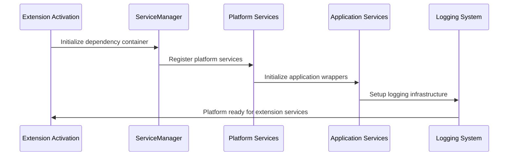
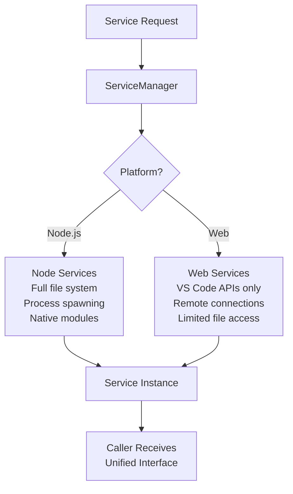
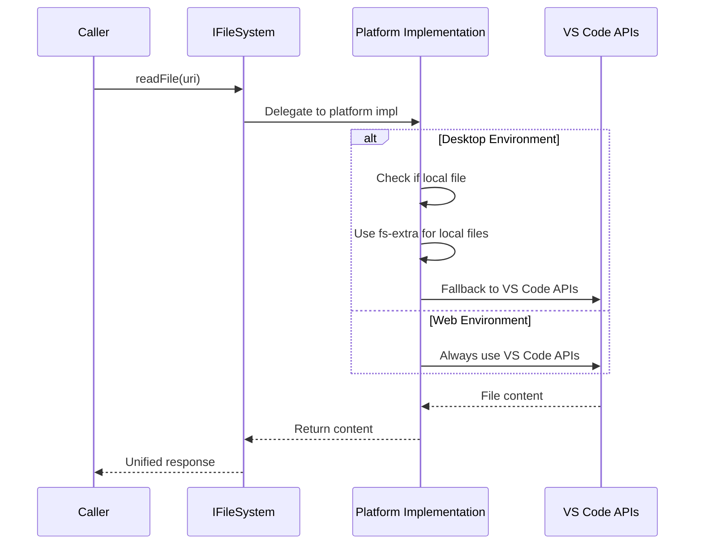
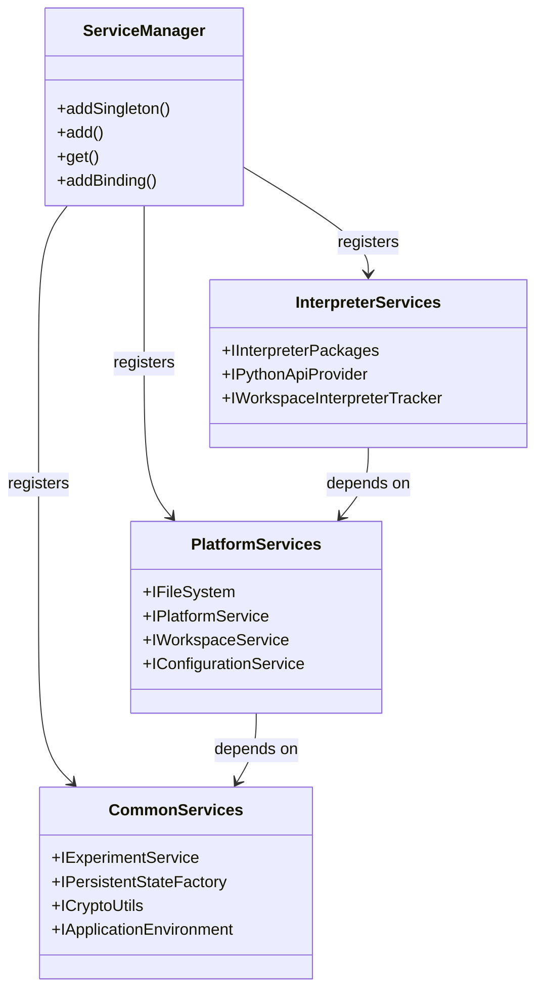
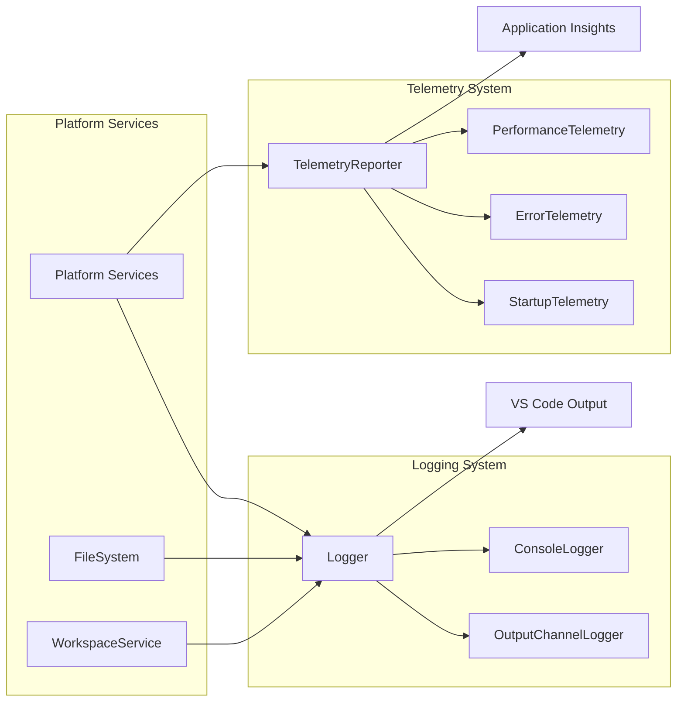

# Platform System Architecture

The `src/platform` directory contains the foundational cross-platform abstraction layer that enables the Jupyter extension to operate seamlessly across desktop (Node.js) and web (browser) environments. This system provides unified interfaces for system resources, dependency injection, logging, telemetry, and other core services while handling platform-specific implementations transparently.

## Core Components Overview

### Dependency Injection System (`ioc/`)

The platform uses **Inversify** as its dependency injection container to manage complex service relationships and enable clean separation of concerns:

**Key Files**:
- `container.ts`: ServiceContainer implementation wrapping Inversify container
- `serviceManager.ts`: ServiceManager for registering and resolving dependencies
- `types.ts`: Core interfaces for dependency injection (`IServiceManager`, `IServiceContainer`)

**Registration Pattern**:
```typescript
export const IFileSystem = Symbol('IFileSystem');
export interface IFileSystem {
    arePathsSame(path1: vscode.Uri, path2: vscode.Uri): boolean;
}

export function registerTypes(serviceManager: IServiceManager) {
    serviceManager.addSingleton<IFileSystem>(IFileSystem, FileSystem);
    serviceManager.addSingleton<IPlatformService>(IPlatformService, PlatformService);
    // Additional registrations...
}
```

**Usage Pattern**:
```typescript
@injectable()
export class ExampleService {
    constructor(
        @inject(IFileSystem) private fileSystem: IFileSystem,
        @inject(IPlatformService) private platform: IPlatformService
    ) {}
}
```

### Cross-Platform Abstractions

#### File System Abstraction (`common/platform/`)

Provides unified file system operations across Node.js and web environments:

**Core Interfaces**:
- `IFileSystem`: VS Code FileSystem API wrapper for cross-platform compatibility
- `IFileSystemNode`: Extended interface for Node.js-specific operations
- `IPlatformService`: Operating system and platform detection services

**Platform Implementations**:
- **Desktop** (`fileSystem.node.ts`): Full file system access with Node.js fs-extra
- **Web** (`fileSystem.ts`): Limited to VS Code workspace APIs
- **Platform Service** (`platformService.{node,web}.ts`): OS detection and platform utilities

**Key Features**:
- Unified URI-based file operations
- Cross-platform path handling via `vscode-path/`
- Temporary file creation and management
- Platform-specific optimizations (local file access in desktop)

#### Application Services (`common/application/`)

Wraps VS Code APIs for consistent cross-platform usage:

**Major Services**:
- `IWorkspaceService`: Workspace folder and working directory computation
- `IDebugService`: Debugging session management wrapper
- `IApplicationEnvironment`: VS Code version and environment detection
- `IEncryptedStorage`: Secure credential storage

**Platform Differences**:
- **Desktop**: Full workspace access, process spawning, native debugging
- **Web**: Limited to browser-compatible VS Code APIs

### Logging Infrastructure (`logging/`)

Centralized logging system with multiple output channels and configurable levels:

**Key Components**:
- `OutputChannelLogger`: VS Code output channel integration
- `ConsoleLogger`: Development console logging
- `LogLevel`: Configurable logging levels (trace, debug, info, warn, error)

**Usage Pattern**:
```typescript
import { logger } from '../platform/logging';

// Structured logging with context
logger.info(`Kernel ${kernelId} started successfully`);
logger.error(`Failed to launch kernel`, new Error('Connection timeout'));
```

**Features**:
- Automatic PII scrubbing (user paths, home directories)
- Performance tracing with decorators
- Telemetry integration for error tracking

### Telemetry System (`telemetry/`)

Comprehensive usage analytics and error reporting infrastructure:

**Core Components**:
- `telemetry.ts`: Resource-specific telemetry tracking
- `startupTelemetry.ts`: Extension activation metrics
- `helpers.ts`: Safe hashing and data anonymization utilities

**Key Features**:
- GDPR-compliant data collection with hashed identifiers
- Platform-specific metrics (OS version, architecture, capabilities)
- Error context preservation for debugging
- Performance measurement integration

### Python Environment Integration (`interpreter/`)

Python environment discovery, management, and package tracking:

**Major Services**:
- `IInterpreterPackages`: Package version tracking and validation
- `IReservedPythonNamedProvider`: Python namespace conflict detection
- `IWorkspaceInterpreterTracker`: Active interpreter monitoring for telemetry

**Platform-Specific Features**:
- **Desktop**: Full Python environment discovery, package management
- **Web**: Limited to remote Python environments via APIs

### API Integration (`api/`)

Integration with VS Code Python extension and other external APIs:

**Key Services**:
- `IPythonApiProvider`: Python extension API integration
- `IPythonExtensionChecker`: Python extension availability detection
- Python environment enumeration and management

## High-Level Operations Workflows

### Extension Activation Flow



### Cross-Platform Service Resolution



### File System Operation Flow



## Platform Differences

### Desktop Environment (Node.js)

**Capabilities**:
- **Full file system access**: Direct Node.js fs operations with fs-extra
- **Process management**: Spawn kernels, run shell commands
- **Native modules**: ZeroMQ for kernel communication, native Python detection
- **System integration**: Environment variable access, user home directory
- **Debugging support**: Full VS Code debugging API access

**Service Implementations**:
- `FileSystem` extends base with local file optimizations
- `PlatformService` provides OS detection and system paths
- `WorkspaceService` computes working directories with file system access

### Web Environment (Browser)

**Limitations**:
- **Limited file system**: Only VS Code workspace APIs available
- **No process spawning**: Cannot launch local kernels or execute shell commands
- **Remote-only**: Must connect to existing Jupyter servers via HTTP/WebSocket
- **Restricted APIs**: No access to user file system, environment variables

**Service Implementations**:
- `FileSystem` limited to VS Code FileSystem API
- `PlatformService` returns unknown OS with undefined paths
- `WorkspaceService` uses VS Code workspace folder APIs only

## Component Interactions

### Service Registration Architecture



### Logging and Telemetry Integration



## Development Guidelines

### Adding New Platform Services

1. **Define Interface**: Create service interface in appropriate types file
2. **Implement Platforms**: Create separate `.node.ts` and `.web.ts` implementations
3. **Register Service**: Add to platform service registry files
4. **Handle Limitations**: Gracefully degrade functionality in web environment
5. **Add Tests**: Unit tests for both platform implementations

### Cross-Platform Compatibility Patterns

- **Feature Detection**: Check platform capabilities before using advanced features
- **Graceful Degradation**: Provide fallback behavior for limited environments
- **Unified Interfaces**: Abstract platform differences behind common interfaces
- **Error Handling**: Platform-specific error messages and recovery strategies

### Platform-Specific File Naming

- **Shared Logic**: `service.ts` - Common business logic
- **Desktop-Specific**: `service.node.ts` - Node.js implementation
- **Web-Specific**: `service.web.ts` - Browser implementation
- **Base Classes**: `service.base.ts` - Shared implementation details

### Dependency Injection Best Practices

- **Interface-Based**: Always inject interfaces, not concrete classes
- **Lifecycle Management**: Use appropriate lifetime (singleton, transient, scoped)
- **Circular Dependencies**: Avoid circular references through careful design
- **Testing**: Use mock implementations for unit testing

### Logging Guidelines

- **Structured Logging**: Include relevant context (kernel ID, notebook URI)
- **Performance Tracing**: Use decorators for method execution timing
- **Error Context**: Preserve error details for debugging while scrubbing PII
- **Log Levels**: Use appropriate levels (trace for detailed debug, error for failures)

This architecture provides a robust foundation for cross-platform operation while maintaining clean separation between platform-specific implementations and business logic. The dependency injection system enables flexible service composition and testability, while the abstraction layers ensure consistent behavior across desktop and web environments.
