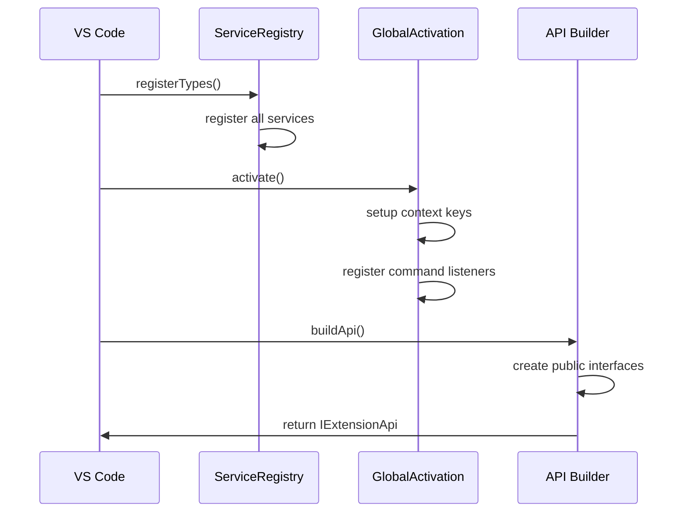
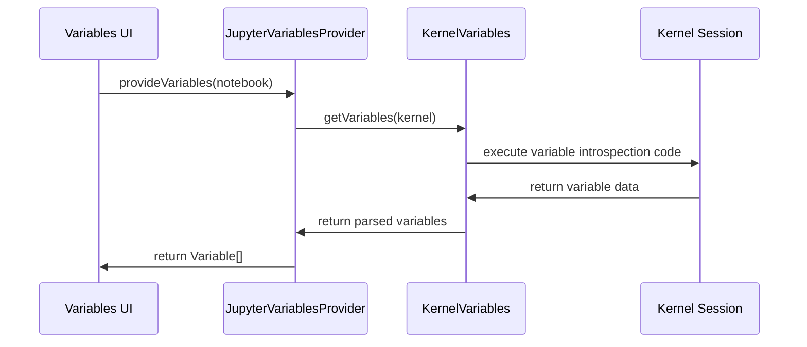

## Standalone System Architecture

The `src/standalone` directory contains modular, self-contained components that provide extended functionality for the Jupyter extension. These components can operate independently while integrating seamlessly with the core kernel and notebook systems.

### Project Structure and Organization

The standalone system follows a service-oriented architecture with clear separation of concerns:

```
src/standalone/
├── serviceRegistry.{node,web}.ts          # Dependency injection registration
├── activation/                            # Extension lifecycle management
│   ├── globalActivation.ts               # Global extension activation
│   ├── activationManager.ts              # Activation orchestration
│   └── workspaceActivation.node.ts       # Workspace-specific activation
├── api/                                   # Public API interfaces
│   ├── index.ts                          # Main API builder
│   ├── kernels/                          # Kernel API management
│   ├── servers/                          # Server collection API
│   ├── pythonExtension/                  # Python extension integration
│   └── unstable/                         # Experimental APIs
├── chat/                                  # VS Code Chat integration
│   ├── extension.node.ts                 # Chat activation
│   ├── listPackageTool.node.ts          # Package listing tool
│   ├── installPackageTool.node.ts       # Package installation tool
│   ├── configureNotebook*.ts            # Notebook configuration tools
│   └── restartKernelTool.node.ts        # Kernel restart tool
├── import-export/                         # Notebook conversion
│   ├── jupyterExporter.ts                # Export notebooks to .ipynb
│   ├── jupyterImporter.node.ts           # Import .ipynb files
│   ├── commandRegistry.ts               # Export/import commands
│   └── importTracker.ts                 # Import usage tracking
├── variables/                             # Variable inspection system
│   ├── JupyterVariablesProvider.ts       # VS Code variables provider
│   ├── kernelVariables.ts               # Kernel variable interface
│   ├── pythonVariableRequester.ts       # Python-specific variables
│   ├── preWarmVariables.node.ts         # Variable pre-loading
│   └── variableResultCache.ts           # Variable result caching
├── codespace/                            # GitHub Codespaces integration
├── context/                              # Editor context management
├── devTools/                             # Development utilities
├── intellisense/                         # Code completion support
├── notification/                         # User notifications
├── recommendation/                       # Extension recommendations
├── survey/                               # User feedback collection
├── userJupyterServer/                    # Custom server management
└── userJupyterHubServer/                 # JupyterHub integration
```

## Core Components

### 1. Service Registration (`serviceRegistry.{node,web}.ts`)

**Purpose**: Central dependency injection configuration for all standalone components

**Key Registrations**:
- **Activation Services**: Global and workspace activation managers
- **API Services**: Kernel API factory, server collections, Python integration
- **Import/Export**: Notebook conversion services and command registration
- **Variables**: Variable providers and requesters for different languages
- **Chat Tools**: Package management and configuration tools
- **UI Services**: Surveys, notifications, recommendations

**Platform Variants**:
- **Node.js** (`serviceRegistry.node.ts`): Full feature set with file system access
- **Web** (`serviceRegistry.web.ts`): Browser-compatible subset without native tools

### 2. Activation System (`activation/`)

**Components**:
- **`GlobalActivation`**: Initializes extension-wide services, command listeners, and context keys
- **`ActivationManager`**: Orchestrates activation sequence and handles errors
- **`WorkspaceActivation`**: Manages workspace-specific initialization

**Activation Flow**:


### 3. Public API System (`api/`)

**Main API Builder** (`index.ts`):
- Exposes `IExtensionApi` interface for other extensions
- Provides kernel services, server collections, and Python environment APIs
- Returns service container in development mode for testing

**API Components**:
- **Kernels API** (`kernels/`): Manages kernel access permissions and provides programmatic kernel control
- **Servers API** (`servers/`): Creates and manages Jupyter server collections for remote connections
- **Python Extension API** (`pythonExtension/`): Integrates with Python extension for environment management
- **Unstable APIs** (`unstable/`): Experimental features like notebook opening and server provider registration

### 4. Chat Integration (`chat/`)

**Purpose**: VS Code Language Model Tools for Jupyter notebook assistance

**Chat Tools**:
- **`ListPackageTool`**: Lists installed packages in the current kernel
- **`InstallPackagesTool`**: Installs packages via pip/conda into the kernel
- **`ConfigureNotebookTool`**: Configures notebook settings and kernel selection
- **`RestartKernelTool`**: Restarts the notebook kernel with user confirmation

**Tool Registration Pattern**:
```typescript
context.subscriptions.push(
    vscode.lm.registerTool(
        InstallPackagesTool.toolName,
        new InstallPackagesTool(kernelProvider, controllerRegistration, installationManager)
    )
);
```

### 5. Import/Export System (`import-export/`)

**Components**:
- **`JupyterExporter`**: Converts VS Code notebook data to `.ipynb` format
- **`JupyterImporter`**: Converts `.ipynb` files to VS Code notebook format
- **`CommandRegistry`**: Registers export/import commands in VS Code
- **`ImportTracker`**: Tracks import usage for telemetry and UX improvements

**Export Workflow**:


### 6. Variables System (`variables/`)

**Architecture**:
- **`JupyterVariablesProvider`**: Implements VS Code's `NotebookVariablesProvider` API
- **`KernelVariables`**: Core variable inspection logic
- **`PythonVariablesRequester`**: Python-specific variable extraction
- **`VariableResultCache`**: Caches variable data for performance
- **`PreWarmVariables`**: Pre-loads variables for faster display

**Variable Flow**:


## High-Level Operations

### Extension Activation



### Chat Tool Invocation


### Variable Inspection



## Platform Differences

### Node.js Environment
- **Full Chat Integration**: All chat tools available including package installation
- **File System Access**: Complete import/export functionality
- **Process Management**: Can spawn processes for package installation
- **Native Dependencies**: Access to ZeroMQ and other native modules

### Web Environment
- **Limited Chat Tools**: Basic tools only, no package installation
- **Browser File API**: Limited file access through VS Code APIs
- **No Process Spawning**: Cannot install packages or spawn subprocesses
- **HTTP-Only**: All operations must use HTTP/WebSocket protocols

## Integration Points

### With Core Systems
- **Kernel Provider**: Accesses running kernels for variable inspection and chat operations
- **Controller Registration**: Manages notebook controller selection and configuration
- **Execution System**: Monitors kernel status for variable updates and chat tool availability

### With VS Code APIs
- **Language Model Tools**: Integrates with VS Code's chat system
- **Variables Provider**: Implements native variable inspection interface
- **Command Registration**: Registers import/export and configuration commands
- **Notifications**: Shows user feedback and recommendations

### With External Extensions
- **Python Extension**: Provides environment management and interpreter access
- **Remote Extensions**: Supports GitHub Codespaces and remote development scenarios

## Development Guidelines

### Adding New Chat Tools
1. Create tool class extending `BaseTool<T>`
2. Implement `prepareInvocationImpl()` and `invokeImpl()` methods
3. Register tool in `chat/extension.node.ts`
4. Add appropriate service dependencies
5. Handle kernel availability and user confirmation

### Adding New API Endpoints
1. Define interface in appropriate `api/` subdirectory
2. Implement service class with dependency injection
3. Register in `serviceRegistry.{node,web}.ts`
4. Add to public API in `api/index.ts`
5. Consider platform differences (Node.js vs Web)

### Adding Variable Providers
1. Implement `IKernelVariableRequester` interface
2. Register with unique identifier in service registry
3. Handle kernel-specific variable extraction logic
4. Integrate with caching system for performance
5. Support both summary and detailed variable views

### Testing Considerations
- Mock kernel providers and controller registration for unit tests
- Test both Node.js and Web service registrations
- Verify chat tool error handling and user feedback
- Test variable caching and invalidation logic
- Ensure API backward compatibility

This architecture provides a flexible, extensible foundation for standalone Jupyter extension features while maintaining clear separation from core kernel and notebook functionality. The service-oriented design enables easy testing, platform-specific implementations, and future feature additions.
