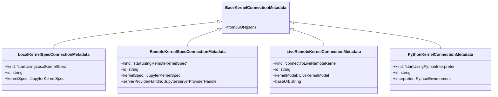
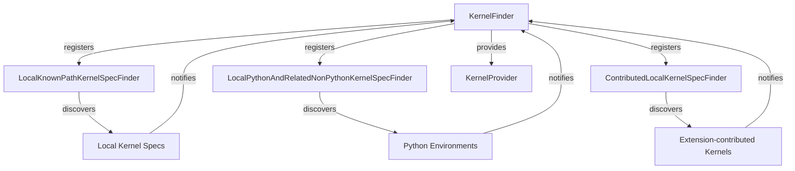
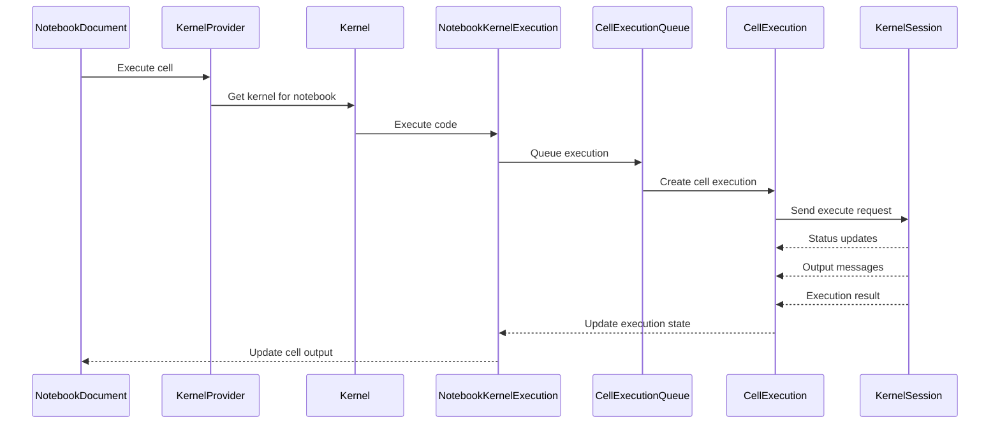
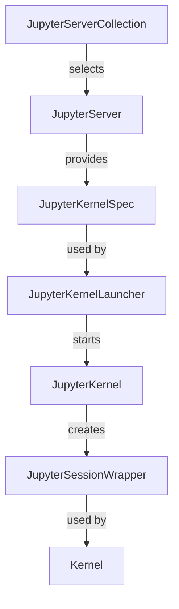
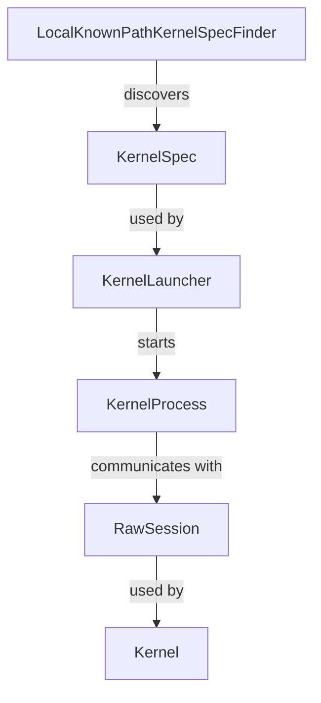
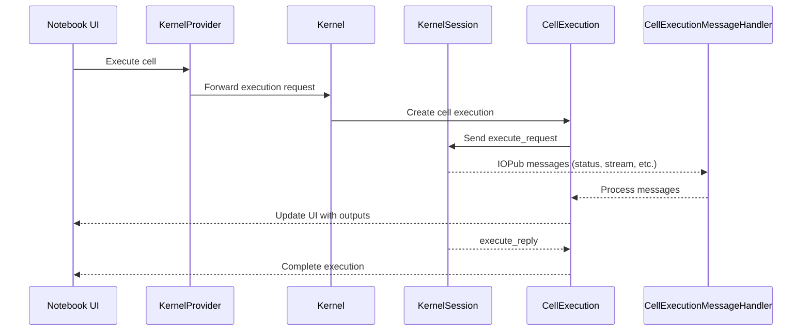
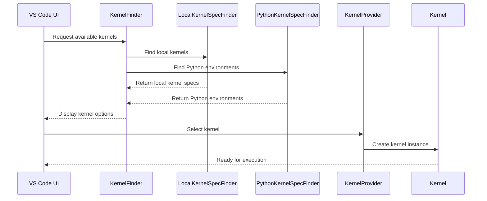
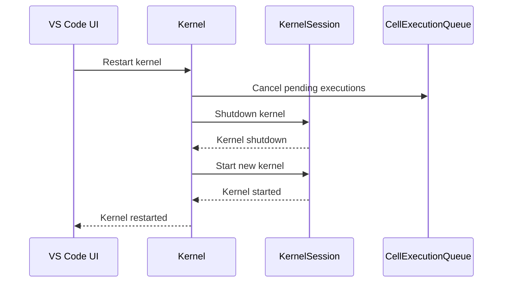

# Kernel System Architecture

The `src/kernels` directory contains the core components responsible for kernel management, discovery, execution, and communication in the Jupyter extension. This system enables the execution of code in notebooks and interactive windows through various kernel types (local Python, remote Jupyter, etc.).

## Core Components Overview

### Kernel Types and Connection Metadata

The kernel system defines several types of kernel connections through classes that inherit from `BaseKernelConnectionMetadata`:

- `LocalKernelSpecConnectionMetadata`: For kernels launched using local kernel specs
- `RemoteKernelSpecConnectionMetadata`: For kernels launched using kernel specs on remote Jupyter servers
- `LiveRemoteKernelConnectionMetadata`: For connecting to already running kernels on remote Jupyter servers
- `PythonKernelConnectionMetadata`: For kernels launched using local Python interpreters

These connection metadata classes provide the necessary information to connect to and interact with different kernel types.

### Kernel Discovery

Kernel discovery is handled by the `KernelFinder` class, which acts as a registry for various kernel finder implementations. The system uses a plugin architecture where different finders can be registered:

1. `LocalKnownPathKernelSpecFinder`: Discovers kernels in standard system locations
2. `LocalPythonAndRelatedNonPythonKernelSpecFinder`: Discovers Python environments and related kernels
3. `ContributedLocalKernelSpecFinder`: Manages kernels contributed by extensions

The discovery process is event-driven, with finders notifying the `KernelFinder` when kernels are found or removed.

### Kernel Provider

The `KernelProvider` class is responsible for creating and managing kernel instances. It acts as a central hub for:

1. Creating new kernels based on connection metadata
2. Tracking active kernels by notebook document
3. Managing kernel lifecycle events (start, restart, dispose)
4. Providing access to kernel execution capabilities

There are separate implementations for Node.js (`kernelProvider.node.ts`) and web environments (`kernelProvider.web.ts`), with common functionality in `kernelProvider.base.ts`.

### Kernel Execution

Kernel execution is handled through several coordinated components:

1. `NotebookKernelExecution`: Main class managing cell execution for a notebook
2. `CellExecution`: Manages the lifecycle of an individual cell execution
3. `CellExecutionQueue`: Queues and schedules cell executions
4. `CellExecutionMessageHandler`: Processes messages from the kernel during execution

The execution flow involves:

### Kernel Sessions

The kernel session implementations handle the low-level communication with kernel processes:

1. `JupyterSessionWrapper`: Manages sessions with Jupyter kernels (local or remote)
2. `RawSession`: Manages direct communication with local kernels without Jupyter server

Both implement the `IKernelSession` interface, providing a consistent API for kernel communication regardless of the underlying connection type.

## Kernel Types and Implementations

### Jupyter Kernels

Jupyter kernels are managed through the components in the `jupyter` directory:

1. **Connection**: Handles server connections and authentication
2. **Finder**: Discovers kernels on Jupyter servers
3. **Launcher**: Starts kernels on Jupyter servers
4. **Session**: Manages communication with Jupyter kernels

The workflow for connecting to a Jupyter kernel is:

### Raw Kernels

Raw kernels provide direct communication with kernel processes without a Jupyter server:

1. **Finder**: Discovers local kernel specs
2. **Launcher**: Starts local kernel processes
3. **Session**: Manages communication with local kernels

The workflow for starting a raw kernel is:

## Monitoring and Reliability

Several monitoring components ensure reliable kernel operation:

1. `KernelCrashMonitor`: Detects and handles kernel crashes
2. `KernelAutoReConnectMonitor`: Attempts to reconnect to lost kernels
3. `KernelAutoRestartMonitor`: Automatically restarts failed kernels

These components improve robustness by recovering from common failure scenarios automatically.

## Dependency Injection and Registration

The kernel system uses dependency injection for component registration and lifecycle management. The key registration files are:

- `serviceRegistry.node.ts`: Registers services for Node.js environment
- `serviceRegistry.web.ts`: Registers services for web environment

Each component is registered with appropriate interfaces and lifecycle hooks.

## Feature Workflows

### Cell Execution Workflow

### Kernel Discovery and Connection Workflow

### Kernel Restart Workflow

## Key Interfaces

- `IKernelFinder`: Discovers and lists available kernels
- `IKernelProvider`: Creates and manages kernel instances
- `IKernel`: Represents a running kernel and provides execution capabilities
- `IKernelSession`: Manages communication with kernel processes
- `ICellExecution`: Manages the execution of a single cell

These interfaces provide the foundation for the kernel system's modularity and extensibility.
